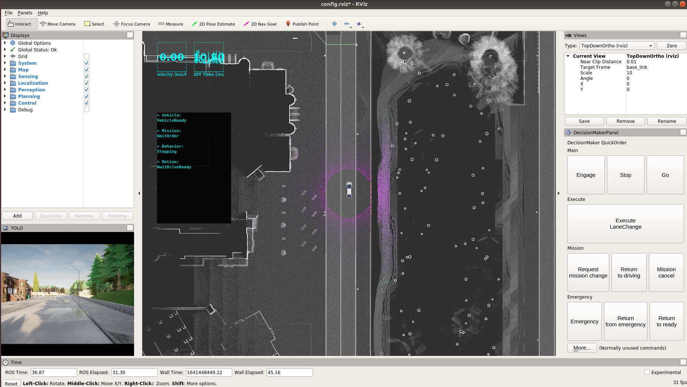
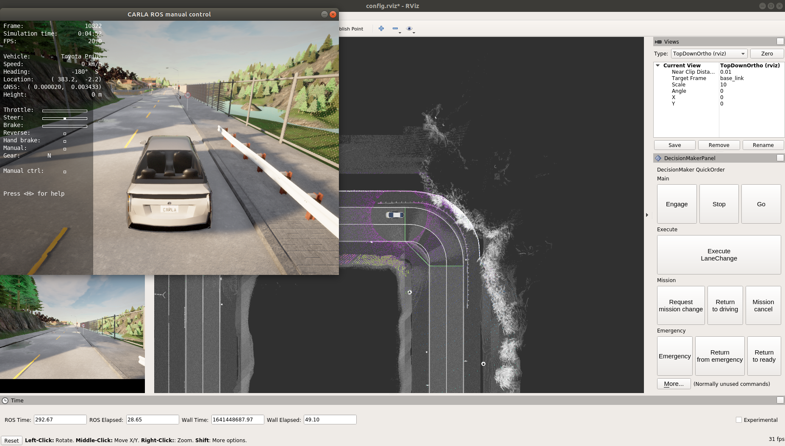

# Quickstarts: Run CARLA and Autoware with Docker

## 1. Build `carla-autoware` Image

Please refer to the step in the link below to build the image.

[Autoware in CARLA](https://github.com/kaka-lin/carla-autoware)

## 2. Pulling and Running the CARLA image

The carla autoware integration now is supports `CARLA 0.9.10.1`

Pull the CARLA image

```bash
$ docker pull carlasim/carla:0.9.10.1
```

Run a CARLA server

```bash
$ docker run --rm \
    -e SDL_VIDEODRIVER='offscreen' \
    --net=host \
    --gpus all \
    carlasim/carla:0.9.10.1 /bin/bash CarlaUE4.sh -opengl
```

## 3. Running the `carla-autoware` image

Open a new terminal and run

```bash
# replae `carla-autoware` to your local path
$ cd carla-autoware
$ ./run.sh
```

## 4. Starting the agent

In the `carla-autoware` container, run the following command

```bash
$ roslaunch carla_autoware_agent carla_autoware_agent.launch town:=Town01
```

then you would see the result as below:



### Using manual control

```bash
$ roslaunch carla_autoware_agent carla_autoware_agent.launch town:=Town01 use_manual_control:=true
```

then you would see the result as below:



then you can Press `H` in the `CARLA ROS manual control` window for more operates information.

For example, if you Press `P`, you would start the autopilot functional, as below:


