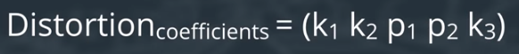

# Camera Calibration

在我們開始做相機校正前，讓我們先來了解`失真(Distortion)`是怎麼發生的

## Pinhole Camera Model (針孔相機模型)

針孔相機模型是在 `Computer Vision` 領域很常用的相機模型,它就好像我們的眼睛在看世界一樣,物體折射的光線透過針孔後投影在相機底片上,且是上下左右顛倒的影像,如下圖所示


透過此方法可以將真實世界的座標(3D)轉成相機上的平面座標(2D)，如下圖所示

```bash
# extrinsic matrix: 旋轉(r11, r12,...) + 位移矩陣 (t1, t2, t3)
1. 物體的在真實世界的原座標(3D) -> 以相機為原點的座標(3D)

# Intrinsic Matrix: 相機內部參數矩陣
2. 相機真實世界座標(3D) -> 相機平面座標(2D)
```


公式如下所示:

$p(u,v) = CP(X,Y,Z)$


## Distortion

在針孔相機模型(Pinhole Camera Model)中,是一個將真實世界物體(3D)投影至相機平面(2D)的理想狀況,然而真實的相機並非使用針孔成像原理進行聚焦,而是由多組鏡頭組成,使其能迅速成像,如下所示


此情況便會造成失真(Distortion),相關情況有:

1. 光線經過透鏡時的所產生的彎曲情況 -> `徑向失真(Redial Distortion)`

    ```
    Real cameras use curved lenses to form an image,
    and light rays often bend a little too much or too little at the edges of these lenses.
    This creates an effect that distorts the edges of images,
    so that lines or objects appear more or less curved than they actually are.
    ```

    
    https://allen108108.github.io/blog/2020/02/15/%E5%BD%B1%E5%83%8F%E7%95%B8%E8%AE%8A%20Image%20Distortion/

2. 透鏡與成像平面是否平行-> `Tangential Distortion`

    ```
    This occurs when a camera’s lens is not aligned perfectly parallel to the imaging plane,
    where the camera film or sensor is.
    This makes an image look tilted so that some objects appear farther away or closer than they actually are.
    ```

    
    https://pic.pimg.tw/silverwind1982/1469173581-3740628882.png


## Distortion Coefficients and Correction

為了在汽車行進時，得到正確的位置(與前車位置等等), 所以我們需要去除圖片的失真, 以精卻反應環境情況。

所幸失真一般可以通過5個參數進行消除,稱為 `Distortion Coefficients(失真係數)`,他們的值反應的圖像中的`Redial Distortion`與`Tangential Distortion`,如下所示:



在某些嚴重失真的情況下,甚至需要5個以上的失真係數,才能確定所有圖像的失真信息

### Redial Distortion

There are three coefficients needed to correct for `radial distortion`: `k1`, `k2`, and `k3`.

Radial distortion can be represented as follows:


#### Note:

The distortion coefficient `k3` is required to accurately reflect major radial distortion (like in wide angle lenses). However, for minor radial distortion, which most regular camera lenses have, k3 has a value close to or equal to zero and is negligible. *`So, in OpenCV, you can choose to ignore this coefficient`*; this is why it appears at the end of the distortion values array: [k1, k2, p1, p2, k3].


Points in a distorted and undistorted (corrected) image. The point (x, y) is a single point in a distorted image and (x_corrected, y_corrected) is where that point will appear in the undistorted (corrected) image.

### Dangential Distortion

There are two more coefficients that account for `tangential distortion`: `p1` and `p2`, and this distortion can be corrected using a different correction formula.


## Camera Calibration

了解完原理及各公式後,我們終於可以來進行 `Camera Calibration` 了。詳情請看 [camera_calibration.ipynb](./camera_calibration.ipynb)

## Reference

1. [Self Driving Car Engineer Nanodegree](https://www.udacity.com/course/self-driving-car-engineer-nanodegree--nd013)

2. [OpenCV - Calibration](https://docs.opencv.org/4.x/dc/dbb/tutorial_py_calibration.html)

3. [Camera Calibration and 3D Reconstruction](https://docs.opencv.org/2.4/modules/calib3d/doc/camera_calibration_and_3d_reconstruction.html)

4. [Dissecting the Camera Matrix, Part 3: The Intrinsic Matrix](http://ksimek.github.io/2013/08/13/intrinsic/)

5. [Pinhole Camera: 相機校正 (Camera Calibration)](https://silverwind1982.pixnet.net/blog/post/153218861)

6. [Camera Calibration相機校正](https://medium.com/image-processing-and-ml-note/camera-calibration%E7%9B%B8%E6%A9%9F%E6%A0%A1%E6%AD%A3-1d94ffa7cbb4)

7. [影像畸變 Image Distortion](https://allen108108.github.io/blog/2020/02/15/%E5%BD%B1%E5%83%8F%E7%95%B8%E8%AE%8A%20Image%20Distortion/)
