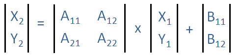
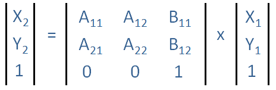
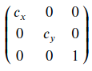
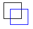
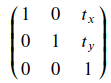
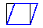
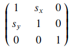
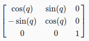

# Affine transformation

```
A geometric transformation that preserves lines and parallelism
```

Affine transformation是一種保留點,直線和平面的線性映射方法,
通常用在*校正幾何失真(geometric distortions)或是變形(deformations)上*。

## Formula

General affine transformation (homogeneous coordinates):

$f(x_2,y_2) = Af(x_1,y_1) + B$



線性轉換(Linear Transformation)定義: $f(a+b) = f(a)+f(b)$



## Type of affine transformation

Affine Transformation 是一種混合的線性二維幾何轉換，而混合的線性轉換包括：`位移`、`放大縮小`、`旋轉` 以及 `Shearing` 的操作。

### Resizing (Scale)




```
cx specifies the scale factor along the x axis
cy specifies the scale factor along the y axis
```

### Translation




```
tx specifies the displacement along the x axis
ty specifies the displacement along the y axis
```

### Shear




```
sx specifies the the shear factor along the x axis
sy specifies the the shear factor along the y axis
```

### Rotation




```
q specifies the angle of rotation
```

## Reference

1. [Self Driving Car Engineer Nanodegree](https://www.udacity.com/course/self-driving-car-engineer-nanodegree--nd013)

2. [Affine transformation - MATLAB & Simulink](https://www.mathworks.com/discovery/affine-transformation.html)

3. [Affine transformation @ 拾人牙慧](https://silverwind1982.pixnet.net/blog/post/160691705)
