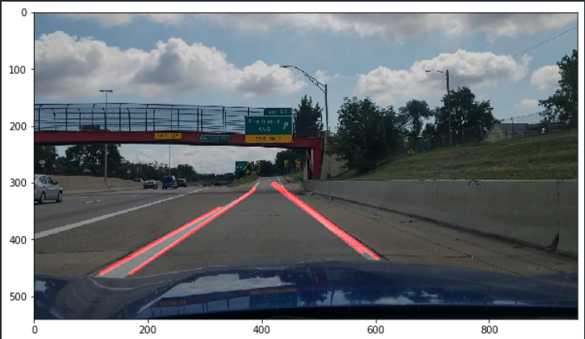
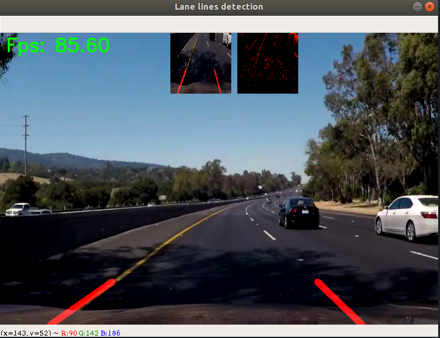

# Finding Lane Lines with Computer Vision

- [Finding Lane Lines](finding_lane_lines.ipynb)

    

- [Advance Lane Lines](advance_lane_lines.ipynb)

    

## Reference

- [udacity/CarND-LaneLines-P1](https://github.com/udacity/CarND-LaneLines-P1)
- [udacity/CarND-Advanced-Lane-Lines](https://github.com/udacity/CarND-Advanced-Lane-Lines)
- [rosskipp/pydata-berlin-2017](https://github.com/rosskipp/pydata-berlin-2017)
