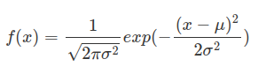

# Gaussian (Normal Distribution)

高斯分佈，又稱常態分佈，是一個非常常見的[連續機率分佈](https://zh.wikipedia.org/wiki/%E6%A6%82%E7%8E%87%E5%88%86%E5%B8%83)。

公式:



其中:

- `μ`: [平均值(mean)](https://en.wikipedia.org/wiki/Mean) or [期望值(expectation)](https://en.wikipedia.org/wiki/Expected_value)

    ```
    決定了分佈位置
    ```

- `σ`: [標準差(standard deviation)](https://en.wikipedia.org/wiki/Standard_deviation)
- `σ^2`: [變異數(variance)](https://en.wikipedia.org/wiki/Variance)

    ```
    決定了分佈的幅度
    ```

高斯(常態)分佈，如下圖所示:


- Note 1: 我們通常所說的`標準常態分佈`: `μ = 0, σ^2 = 1`，如上的紅色曲線
- Note 2: variance 越大，則分佈越寬且矮


## Implementing with python

```python
1 / np.sqrt(2* np.pi * variance) * np.exp(-.5 * (x - mean)**2 / variance)
```


## Reference

- Wiki: [Normal distribution](https://en.wikipedia.org/wiki/Normal_distribution)
