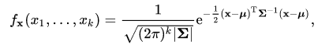
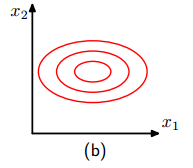
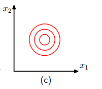
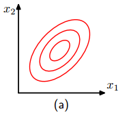

# Multivariate Gaussian Distribution

`高維高斯分佈(High Dimension Gaussian)`，又稱`多元高斯分佈(Multivariate Gaussian)`。

當一個高斯分佈是由多個變數控制時，就稱作 Multivariate gaussain distribution。

公式:

其中:

- `Σ`: [共變異數矩陣(covariance matrix)](https://en.wikipedia.org/wiki/Covariance_matrix)

## 變數是否獨立

當變成高維度，就會產生一個問題，變數是否獨立？
以 2D 為例:

1. 變數彼此完全獨立,其高斯分佈會呈現 orthogonal contour，如下圖:

    

    如果各變數的 `variance` 又剛好相等時:

    

2. 變數間彼此不獨立，如下圖:

    

## Reference

- [Multivariate normal distribution, Wiki](https://en.wikipedia.org/wiki/Multivariate_normal_distribution)
- [Multivariate gaussian distribution, HackMD](https://hackmd.io/@ierosodin/Machine_Learning/https%3A%2F%2Fhackmd.io%2Fs%2Fry1YKGBj7%23)
