# Kalman Filters (卡爾曼濾波器)

`卡爾曼濾波器`又稱為`最佳線性濾波器(輸出值為輸入值的線性組合)`，為實現簡單、純時間域的濾波器。卡爾曼濾波器能夠從時間序列中不完全、包含雜訊的測量中，估計出系統的狀態，但系統必須是線性與動態的。在實現過程中，所有關於不確定性的關係(雜訊)，都會用到共變異數 (covariate) 矩陣。

複習: [Gaussian distribution](https://github.com/kaka-lin/autonomous-driving-notes/tree/master/Kalman%20Filters/Gaussian)

## Kalman Filters 原理

卡爾曼濾波器的主要步驟有兩個: `Measurement Update` and `Prediction`。讓我們先從簡單的一維公式開始，來理解原理。

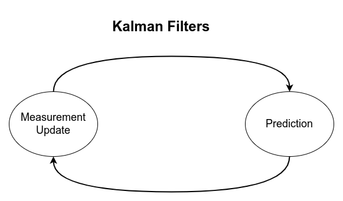

### Measurement Update or Correction (量測更新):

- Requires a [product](https://classroom.udacity.com/courses/cs373/lessons/48739381/concepts/487235990923#)
- Uses [Bayes rule](https://classroom.udacity.com/courses/cs373/lessons/48739381/concepts/487221690923#)

將`當前感測器量測的資訊`與`上一時刻得到的預測資訊`融合。將兩個常態分佈`相乘`，得到`當前系統狀態的最佳估測值`。如下所示:

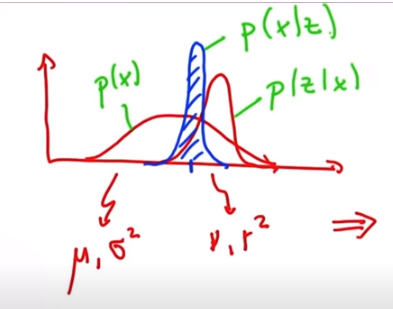
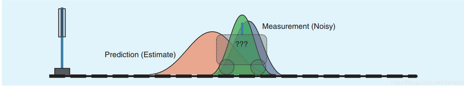

公式:

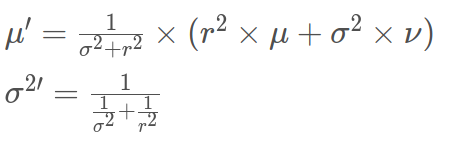

### Motion Update or Prediction (預估)

- Involves a `convolution` or simply an `addition`
- Uses [total probability](https://classroom.udacity.com/courses/cs373/lessons/48739381/concepts/486736290923#)


根據`上一時刻最佳估測值`和`系統方程`預測當前時刻的系統狀態。會得到一個`預測值`，如下所示:

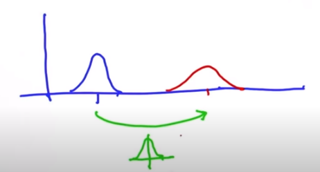

公式:

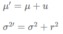


## How kalman filters work

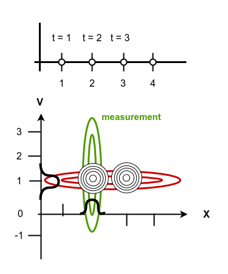

從上圖可觀察:

- t = 2, 綠色高斯分佈:它只有位置的資訊但沒有速度相關的資訊。

    但如果將在 prediction step 算出的值 (prior) 與 measurement step 算出的值相乘，會得到一個當前系統狀態的最佳估測值，他是一個高斯分佈 (上圖中紅綠相交的黑色高斯分佈)。這個高斯分佈對位置與速度都有一個很好的估測 (分別投影至 x 及 v)。

    且如果採用這個高斯分佈進行下一個 Prediction step，會發現前進至下一個黑色的高斯分佈，此正式 t = 3 做一樣事情的結果。

這就是卡爾曼濾波器的工作原理。

## Kalman filters 公式

卡爾曼濾波器有五個公式，分兩個部份:

### 1. Prediction

```
X(k) = F(k) * X(k-1) + B(k) * U(k)
P(k) = F(k) * P(k-l) * F^T(k) + Q(k)
```
- X: estimate
- P: estimate covariance matrix
- F: state-transition model
- B: control-input model
- U: control vector (motion vector)
- Q: the covariance of the process noise

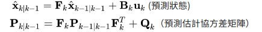

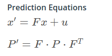

### 2. Measurement Update

```
Y(k) = Z(k) - H(k) * X(k)
S(k) = H(k) * P(k) H^T(k) + R(k)
K(k) = P(k)* H^T(k) * S^-1(k)
```

- Z: measurement
- H: measurement function
- R: measurement noise

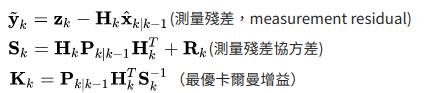

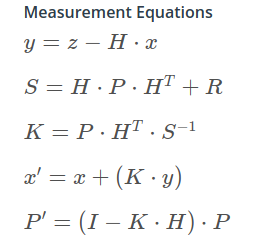


## Reference

- [Kalman filter, Wiki](https://en.wikipedia.org/wiki/Kalman_filter)
- [一維空間的卡爾曼濾波器 Kalman Filter (FORTH語言)](https://ohiyooo2.pixnet.net/blog/post/405342657)
- [卡爾曼濾波 (Kalman Filter), 拾人牙慧](https://silverwind1982.pixnet.net/blog/post/167680859)
- [理解卡爾曼濾波器](https://www.itread01.com/content/1541553003.html)
