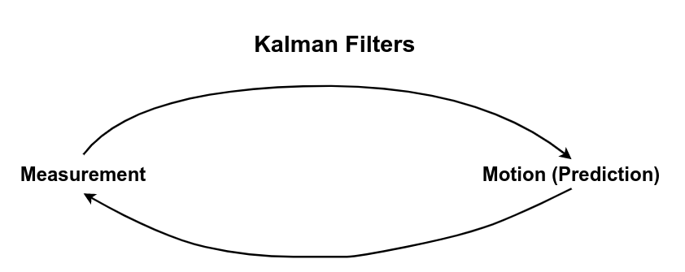

# Kalman Filters

## Gaussian

- [Gaussian](https://github.com/kaka-lin/autonomous-driving-notes/tree/master/Kalman%20Filters/Gaussian)

## Measurement and Motion

The Kalman Filter represents our distributions by `Gaussians` and iterates on two main cycles.

- `Measurement`
- `Motion (Prediction)`

Sebastian summarizes some of the key concepts from these cycles in the below referenced links.
If you are interested, please feel free to check out these links directly from Sebastian's class on [Artificial Intelligence for Robotics](https://classroom.udacity.com/courses/cs373).

### The first cycle is the `Measurement Update`

- Requires a [product](https://classroom.udacity.com/courses/cs373/lessons/48739381/concepts/487235990923#)
- Uses [Bayes rule](https://classroom.udacity.com/courses/cs373/lessons/48739381/concepts/487221690923#)

### The second cycle is the `Motion (Prediction) Update`

- Involves a convolution
- Uses [total probability](https://classroom.udacity.com/courses/cs373/lessons/48739381/concepts/486736290923#)

##
