# State-of-the-Art in 3D Object Detection

```
大多數 CNN 的方法最初來自計算機視覺領域，
並且在開發時考慮了基於圖像的檢測。
因此，為了將這些方法應用於激光雷達點雲，
必須將 3d point 轉換為 2d domain。
```


The pipeline structure consists of three major parts:

1. data representation
2. feature extraction
3. model-based detection.

The following figure shows the data flow through the pipeline with raw point cloud on one end and the classified objects on the other end:

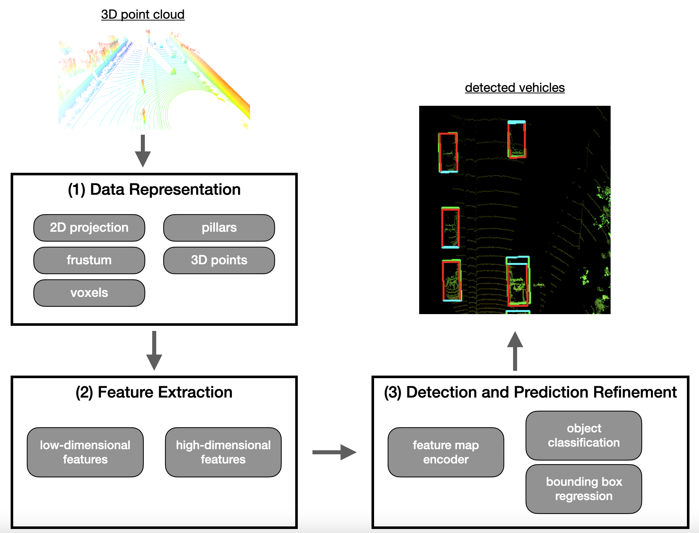

## Step 1. Data representation

點雲一是種非結構化的資料點組合，在測量的範圍內分佈不均勻，根據所選的 `detection model` 不同，點雲有不同的表示方式，現有兩種主要的表示方法:

1. Structur: 將點雲轉成結構化資料, 像是 `voxels`, `pillars`, or `frustums`.
2. Unstructure: 保持原樣，直接處理

### Point-based data representation

Point-based methods `take the raw and unfiltered input point cloud` and `transform it into a sparse representation`

```
適合用來做分類(clustering)
```

此類方法通過考慮相鄰cluster(簇)為每個點提取特徵向量。這種方法通常首先為每個單點尋找低維局部特徵，然後將它們聚合成更大、更複雜的高維特徵。

此類方法代表作為: [PointNet](https://arxiv.org/abs/1612.00593)

- 優點: 點雲結構保持完整，不會丟失信息
- 缺點: 很耗記憶體

### Voxel-based data representation

A voxel is defined as a `volume element` in a three-dimensional grid in space.

A voxel-based approach assigns each point from the input point cloud to a specific volume element. Depending on the coarseness (粗糙度) of the voxel grid, multiple points may land within the same volume element. Then, in the next step, local features are extracted from the group of points within each voxel

此類方法代表作為: [VoxelNet](https://arxiv.org/abs/1711.06396)

- 優點: 相對節省記憶體

    因為減少了必須同時保存在記憶體內的元素(elements)數量，因此特徵提取網路(feature extraction network)的計算效率更高。因為現在是提取一組 voxels 而不是單獨的每個點。

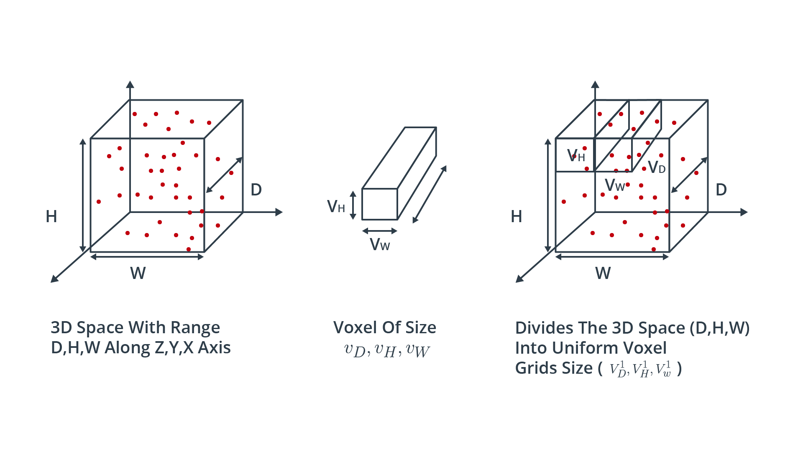

### Pillar-based data representation

An approach very similar to voxel-based representation is the pillar-based approach. Here, the point cloud is clustered not into cubic volume elements but instead into vertical columns rising up from the ground up.

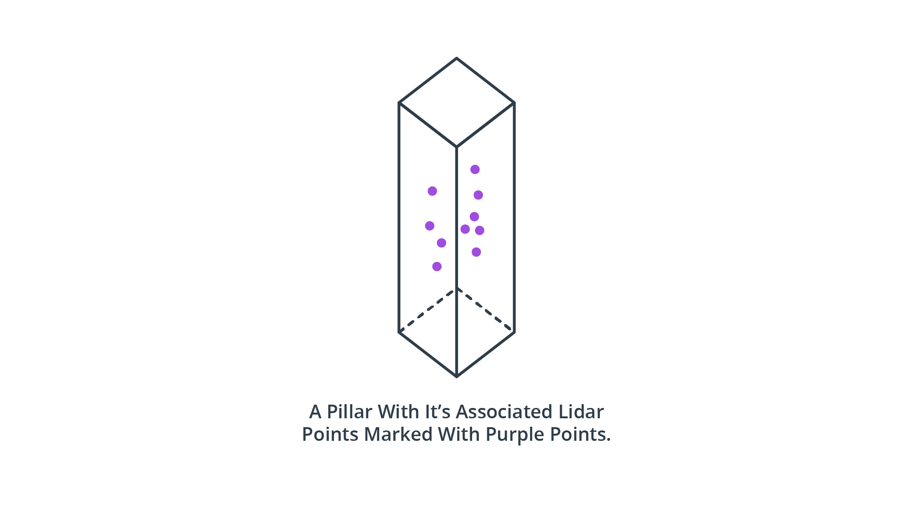

此類方法代表作為: [PointPillars](https://arxiv.org/abs/1812.05784)

- 優點: As with the voxel-based approach, segmenting the point cloud into discrete volume elements saves memory resources - even more so with pillars as there are usually significantly fewer pillars than voxels.

### Frustum-based data representation

當光達與其他sensor(如:相機)結合使用時，點雲可以基於 pre-detected 2d object 來進行分群(clustering)。

如果對象在 image plane 上的投影周圍的 2D 區域已知的話，`frustum` 可以被投影到 3D 空間中，透過相機的內部與外部參數來做校正。

此類方法代表作為: [Frustum PointNets](https://arxiv.org/abs/1711.08488)

- 缺點: 它需要第二個 sensor，如: 相機。

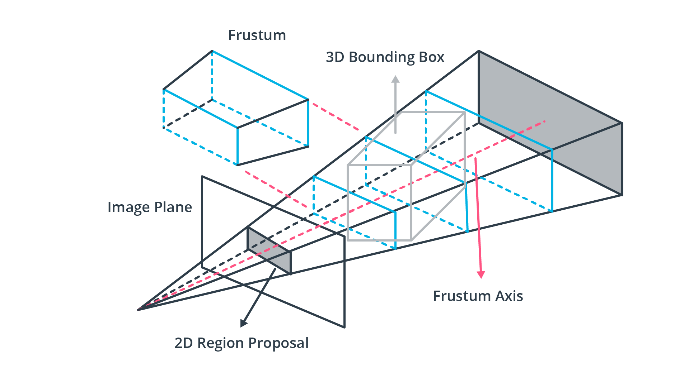

### Projection-based data representation

While both `voxel- and pillar-based algorithms cluster the point-cloud based on a spatial proximity measure`, `projection-based approaches reduce the dimensionality of the 3D point cloud along a specified dimension`.

在文獻中，可以確定三種主要方法:

1. `前視圖 (FV)`: 點雲沿`前向軸(forward-facing axis)`壓縮
2. `範圍視圖 (RV)`: 點雲投影到全景(panoramic)視圖

    As you will recall from the previous lesson, this concept is the one implemented in the Waymo dataset, in which lidar data is stored as `range images`.

3. `鳥瞰圖 (BEV)`: 點雲被投影到地平面上

   在文獻中，BEV 是最廣泛使用的投影方案，原因有:

   - 感興趣的對象與配備 sensor 的車輛位於同一平面上，差異很小
   - 保留了物體之間的物理尺寸和鄰近關係，比 FV 和 RV 投影更清楚地分開他們。

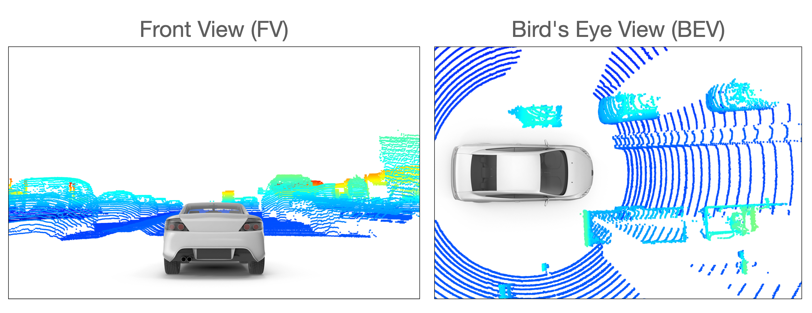

## Step 2. Feature extraction

在將點雲轉換為合適的representation (例如: `BEV 投影`) 後，下一步是識別合適的特徵。
目前最常用的特徵類型是:

- 局部特徵(local): 通常被稱為 `low-level 特徵`

    通常是在非常早期的處理階段獲得的，包含精確的信息，如: localization of individual elements of the data representation structure.

- 全局特徵(global): 也被稱為 `high-level 特徵`

    often encode the geometric structure of an element within the data representation structure in relation to its neighbors.

- 上下文特徵(contextual):

    Contextual features are extracted during the last stage of the processing pipeline. These features aim at being `accurately located` and `having rich semantic information` such as *object class, bounding box shape and size and the orientation of the object*.

### Point-wise feature extractors

The term "point-wise" refers to the fact that the entire point cloud is used as input. This approach is obviously suited for the `point-based data representation` from the first step.

`Point-wise feature extractors` analyze and label each point individually, such as in `PointNet` and `PointNet++`, which currently are among the most well-known feature extractors. To illustrate the principle, let us briefly look at the PointNet architecture, which is illustrated in the following figure:

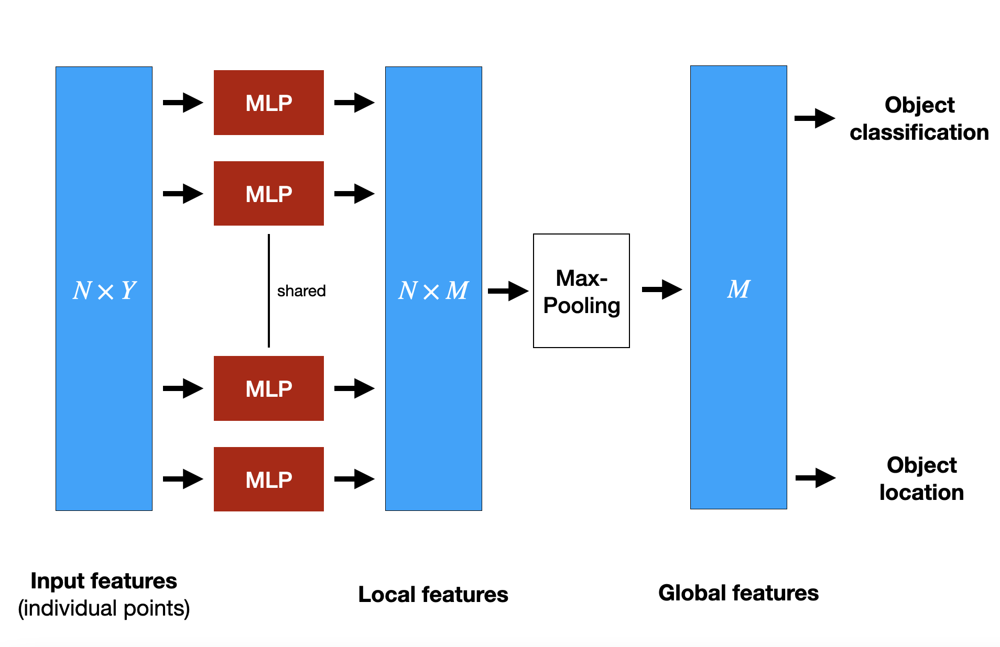
在上圖中，N 是指輸入 PointNet 的點雲數量，Y 是特徵的維度。

`PointNet`使用整個點雲作為輸入。他從歐幾里德空間中的點子集(subset of points)中的每個點的空間特徵中提取 `gloab structures`。為了實現這點，PointNet 實現了一個`非分層神經網路(non-hierarchical neural network )`，它由三個 main blocks 組成:

- max-pooling layer
- 一個用於組合 local 和 global 信息的結構。

    ```
    A structure for combining local and global information
    ```

- 兩個將輸入點與提取的特徵點對齊的網絡

    ```
    Two networks that align the input points with the extracted point features
    ```

In order to extract features point-wise, a set of multi-layer perceptrons (MLP) is used to map each of the `N` points from three dimensions `(x, y, z)` to 64 dimensions. This procedure is then repeated to map the `N` points from 64 dimensions to `M=1024` dimensions. When this is done, max-pooling is used to create a global feature vector in $\mathbb{R}^{1024}$. Finally, a three-layer fully-connected network is used to map the global feature vector to generate both object classification and object location.

PointNet 的缺點之一是它無法捕獲相鄰點之間的 local structure information，因為每個點的特徵都是單獨學習的，而且點之間的關係被忽略了。 這已經得到改進，例如: 在 PointNet++ 中，但為簡潔起見，我們不會在此處詳細介紹。 儘管逐點特徵提取器顯示出非常有希望的結果，但由於記憶體需求高且計算複雜性，它們還不適合用於自動駕駛。

### Segment-wise feature extractors

Due to the high computational complexity of point-based features, alternative approaches are needed so that object detection in lidar point clouds can be used in a real-time environment. The term "segment-wise" refers to the way how the point cloud is divided into spatial clusters (e.g. voxels, pillars, or frustums). Once this has been done, a classification model is applied to each point of a segment to extract suitable volumetric features. One of the most-cited representatives of this class of feature extractors is [VoxelNet](https://arxiv.org/abs/1711.06396). In a nutshell, the idea of VoxelNet is to encode each voxel via an architecture called "Voxel Feature Extractor (VFE)" and then combine local voxel features using 3D convolutional layers and then transform the point cloud into a high dimensional volumetric representation. Finally, a region proposal network processes the volumetric representation and outputs the actual detection results.

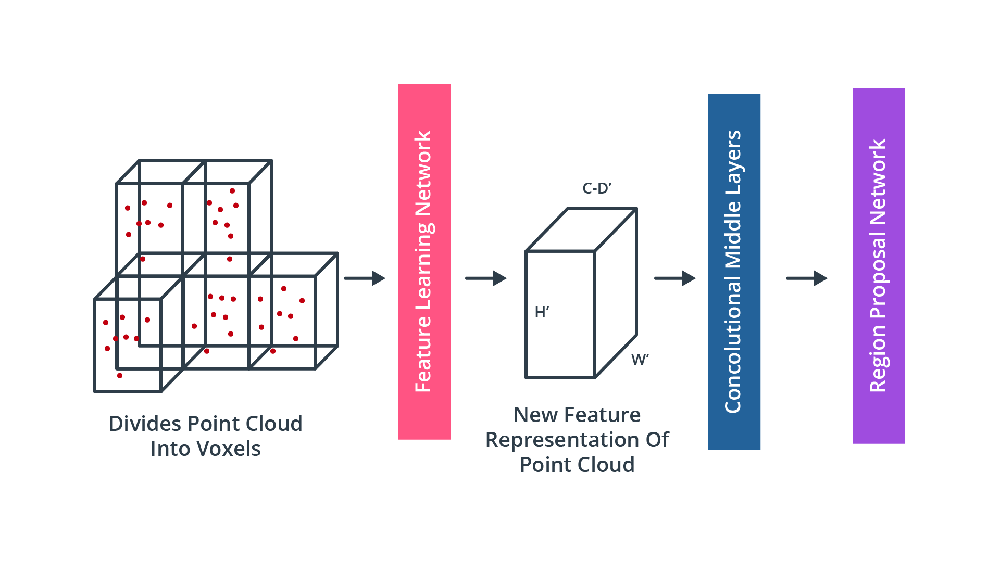

To illustrate the concept, the figure below shows the architecture of the [Voxel Feature Extractor](https://arxiv.org/abs/1711.06396) within the feature learning network shown in the previous diagram:

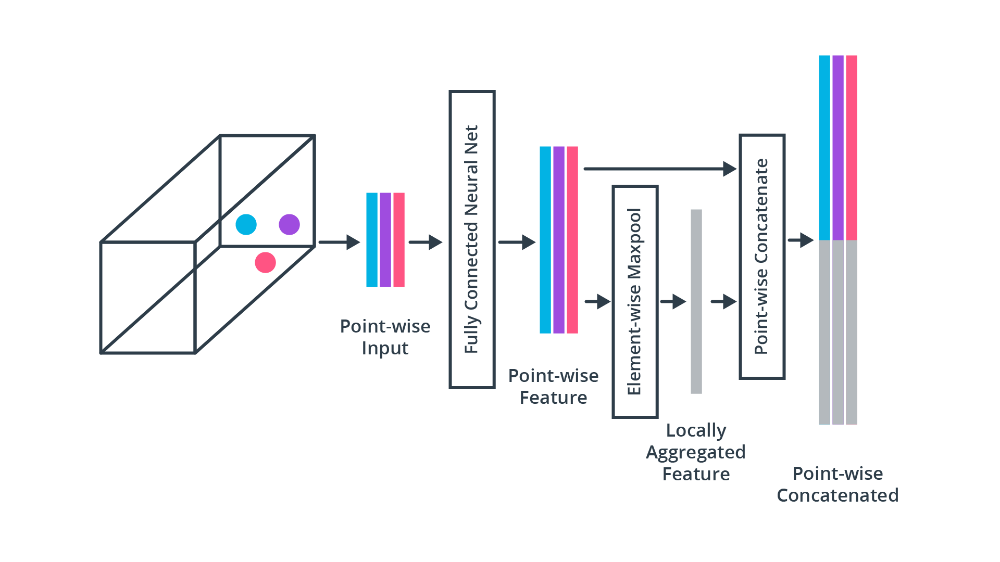

As this chapter is intended to provide a broad overview of the literature, we will not go into further details on VoxelNet or VFE. If you would like to see the algorithm in action, please refer to [this unofficial implementation](https://github.com/qianguih/voxelnet).

## Step 3. Detection and Prediction Refinement

Once features have been extracted from the input data, a detection network is needed to generate contextual features (e.g. object class, bounding box) and finally output the model predictions. Depending on the architecture, the detection process can either perform a single-pass or a dual-pass. Based on the detector network architecture, the available types can be broadly organized into two classes, which are `dual-stage encoders` such as [R-CNN](https://arxiv.org/pdf/1311.2524.pdf), [Faster R-CNN](https://papers.nips.cc/paper/2015/file/14bfa6bb14875e45bba028a21ed38046-Paper.pdf) or [PointRCNN](https://arxiv.org/abs/1812.04244) or `single-stage encoders` such as [YOLO](https://arxiv.org/abs/1506.02640[) or [SSD](https://arxiv.org/abs/1512.02325). In general, single-stage encoders are faster than dual-stage encoders, which makes them more suited for real-time applications such as autonomous driving.

A problem faced by CNN-based object detection is that we do not know how many instances of a certain object type are located within the input data. It could be that only a single vehicle is visible in the point cloud, or it could also be 10 vehicles. A naive approach to solve this problem would be to apply a CNN to multiple regions and check for the presence of objects within each region individually. However, as objects will have different locations and shapes, one would have to select a very large number of regions, which quickly becomes computationally infeasible.

To solve this problem, Ross Girshick et al. proposed a method (R-CNN) where a selective search is used to extract ~2000 regions, which he called region proposals. This meant a significant decrease in the number of regions that needed to be classified. Note that in the original publication, the input data were camera images and not point clouds. The candidate regions are then fed into a CNN to produce a high-dimensional feature vector, from which the presence of objects within the candidate regions is inferred using a support vector machine (SVM). The following figure illustrates the process:

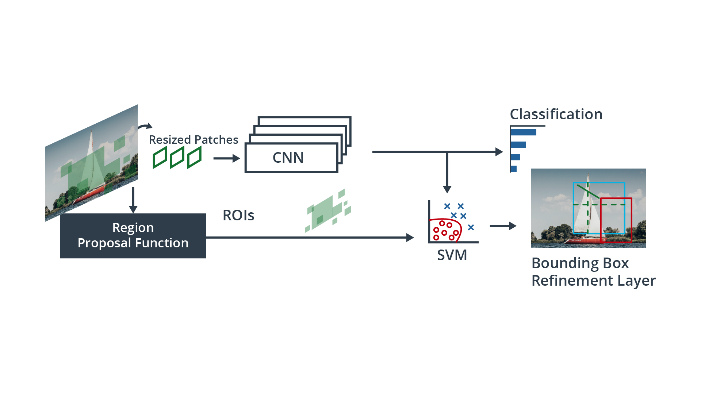

In order to refine the predictions and increase the accuracy of the model output, dual-stage encoders feed the results from the first stage to an additional detection network which refines the predictions by combining different feature types to produce refinement results.

Single-stage object detectors on the other hand perform region proposal, classification and bounding box regression all in one step, which makes them significantly faster and thus more suitable for real-time applications. In many cases though, two-stage detectors tend to achieve better accuracy.

One of the most famous single-stage detectors is YOLO (You Only Look Once). This model runs a deep learning CNN on the input data to produce network predictions. The object detector decodes the predictions and generates bounding boxes, as shown in the figure below:

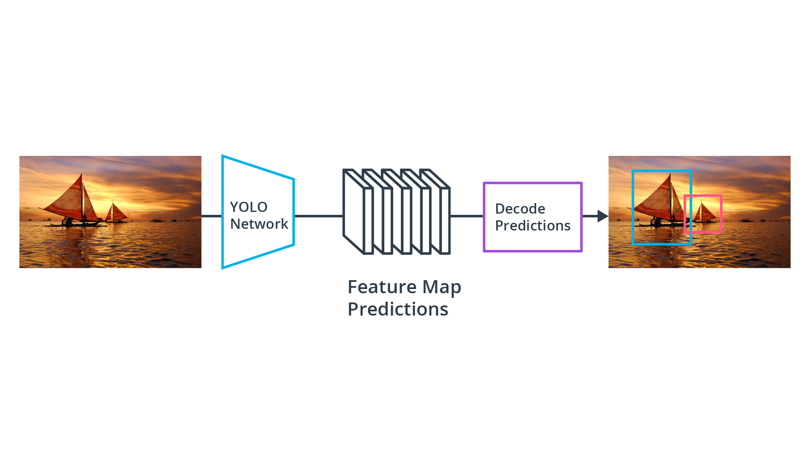

YOLO uses anchor boxes to detect classes of objects, which are predefined bounding boxes of a specific height and width. These boxes are defined to capture the scale and aspect ratio of specific object classes (e.g. vehicles, pedestrians) and are typically chosen based on object sizes in the training dataset. During detection, the predefined anchor boxes are tiled across the image. The network predicts the probability and other attributes, such as background, intersection over union (IoU) and offsets for every tiled anchor box. The predictions are used to refine each individual anchor box.

When using anchor boxes, you can evaluate all object predictions at once without the need for a sliding-window as with many classical applications. An object detector that uses anchor boxes can process the entire input data at once, making real-time object detection systems possible.

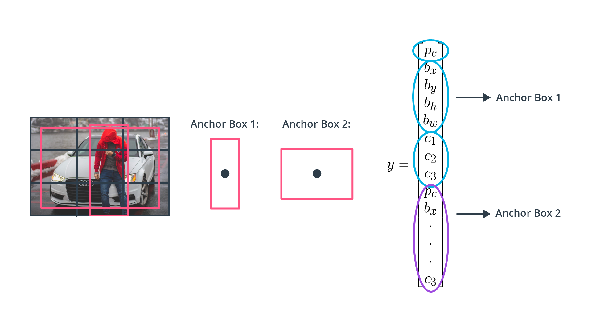

The network returns a unique set of predictions for every anchor box defined. The final feature map represents object detections for each class. The use of anchor boxes enables a network to detect multiple objects, objects of different scales, and overlapping objects.

As stated before, most of the CNN-based approaches originally come from the computer vision domain and have been developed with image-based detection in mind. Hence, `in order to apply these methods to lidar point clouds, a conversion of 3d points into a 2d domain has to be performed`. Which is exactly what we will be doing in the next chapter on object detection in point clouds.
