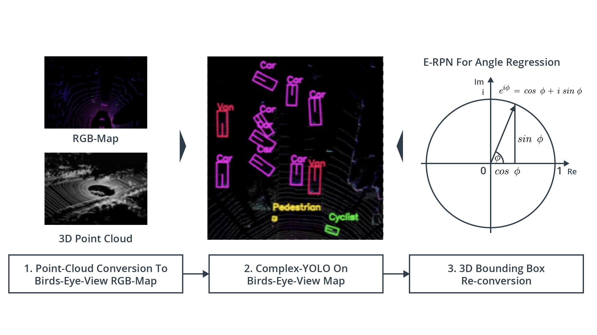
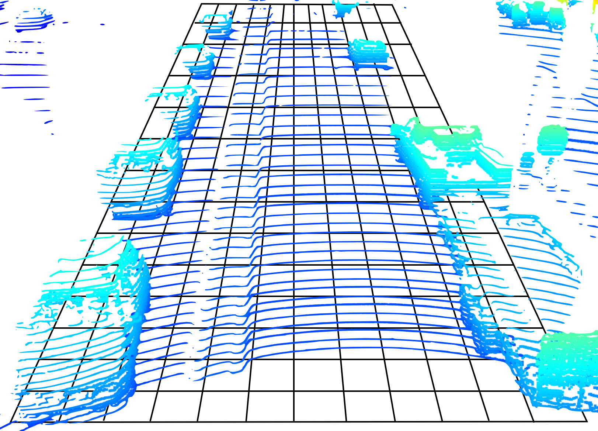
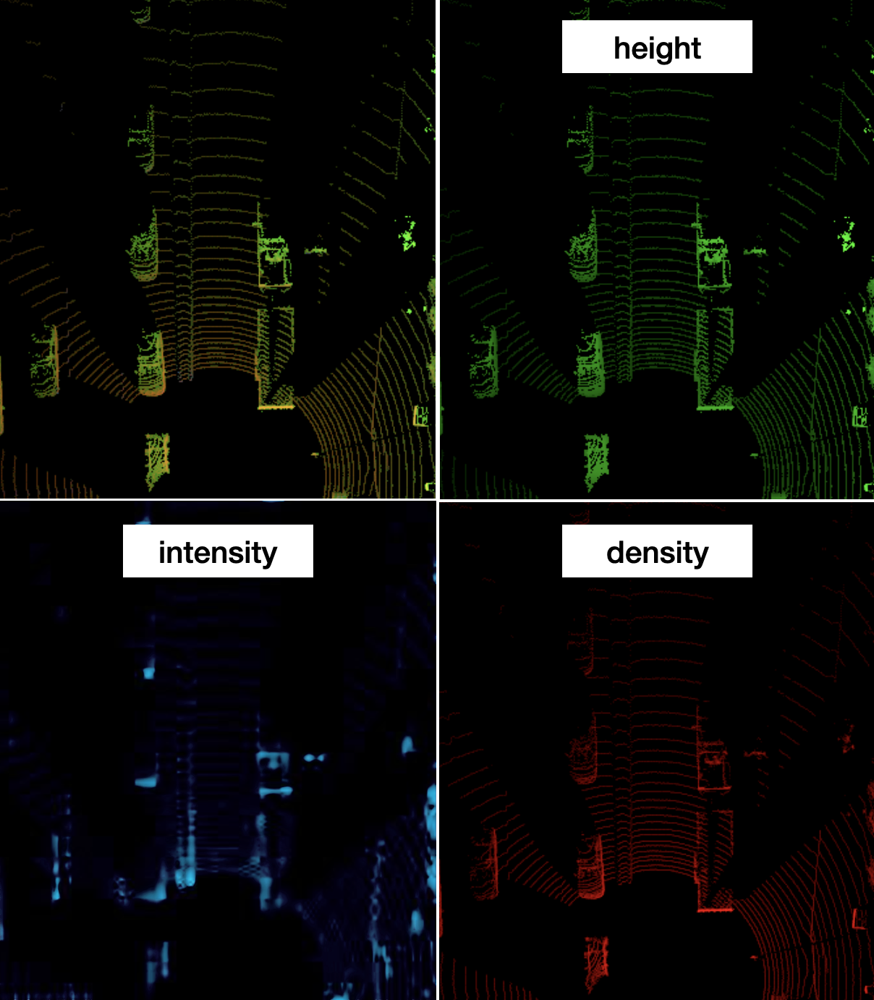
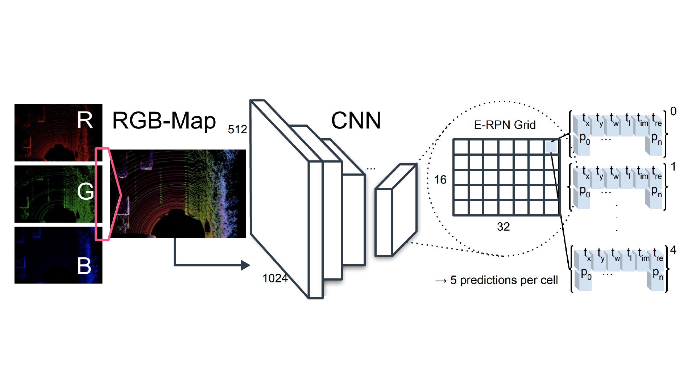
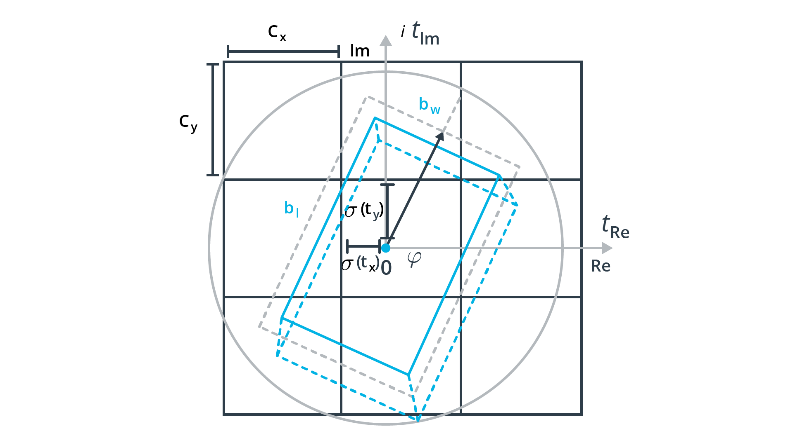
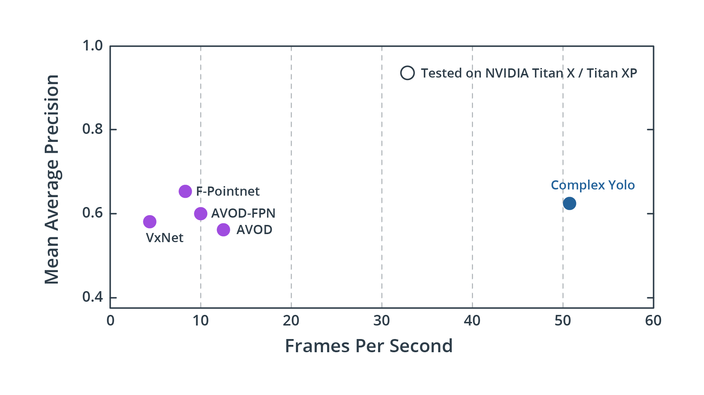

# Complex-YOLO: Real-time 3D Object Detection on Point Clouds

- [The Complex YOLO Algorithm](#the-complex-yolo-algorithm)
- [Why use Complex YOLO?](#why-use-complex-yolo)

## The Complex YOLO Algorithm

In the paper [Complex-YOLO: Real-time 3D Object Detection on Point Clouds](https://arxiv.org/abs/1803.06199), M. Simon et al. extend the famous YOLO network for bounding box detection in 2D images to 3D point clouds. As can be seen from the following figure, the main pipeline of Complex YOLO consists of three steps:

- Step 1. Point-Cloud Conversion To Birds-Eye-View (BEV) RGB-Map
- Step 2. Complex-YOLO On Birds-Eye-View Map
- Step 3. 3D Bounding Box Re-conversion



### Step 1. Transforming the point cloud into a bird's eye view (BEV)

首先，`將 3D 點雲轉換為鳥瞰圖(BEV)`，*which is achieved by compacting(壓縮) the point cloud along the upward-facing axis* (Waymo 車輛坐標系中的 z 軸)。

BEV 被劃分為由大小相等的單元組成的網格(cells)，這使我們能夠將其視為圖像，其中每個 pixel 對應路面上的一個區域。從下圖中可以看出，多個獨立的點時常落在同一個網格元素中，尤其是在與路面正交的表面上，如下圖所示:


Point cloud superimposed on the BEV grid cells

As can be seen, the density of points varies strongly between cells, depending on the presence of objects in the scene. While on the road surface, the number of points is comparatively low due to the angular resolution in vertical direction (64 laser beams), the number of points on the front, back or side of a vehicle is much higher as neighboring vertical LEDs are reflected from the same distance. `This means that we can derive three pieces of information for each BEV cell, which are the "intensity of the points", "their height" and "their density". Hence, the resulting BEV map will have three channels, which from the perspective of the detection network, makes it a color image.`

```
每個 BEV cell 有三個資訊: 點的強度、高度和密度
因此生成的 BEV map 將具有三個 channel
從檢測網路的角度來看，使其成為 color image
```

The process of generating the BEV map is as follows:

1. 我們需要確定我們想要包含的區域。在本課程中:

   - longitudinal range: 0 ~ 50m
   - lateral range: -25 ~ 25m

    選擇這組特定參數的理由部分基於原始論文以及 Complex YOLO 實作中的設計選擇。

2. 我們藉由指定`生成的BEV image 的解析度`或定義`單個網格單元的大小`將區域劃分為網格。

    此課程，將 BEV image 的 size 設置為 `608 x 608 pixels`，這導致`空間解析度約為 8cm`。

    ```
    50m -> 5000cm
    50000cm / 608 = 8cm
    ```

3. 現在我們已經將偵測區域劃分為網格(grid)，我們需要`識別落入每個 cell 的點 Pij 的集合 (the set of points Pij)`。其中 i,j 是各自 cell 的座標。

    As proposed in the original paper, we will assign the following information to the three channels of each cell:

    - Height Hi,j = max(Pi,j ⋅ [0,0,1]T)
    - Intensity Ii,j = max(I(Pi,j))
    - Density Di,j = min(1.0, log(N+1)/64)

As you can see, Hi,j encodes the maximum height in a cell, Ii,j the maximum intensity and Di,j the normalized density of all points mapped into the cell. The resulting BEV image (which you will be creating in the second part of this chapter) looks like the following:



左上角為疊加了所有三個 channel 的 BEV map。
右上角綠色的為高度，可以清楚地看到，車輛車頂的強度高於路面。
左下角藍色的為強度，根據螢幕的對比度，您可能能夠區分尾燈或車牌等物體。
右下角紅色的為密度，可以清楚地看到車輛側面、前面和後面顯示的最多，此外隨著距離增加，路面上點雲的密度越來越小，這顯然與 lidar 的`透視效果(perspective effects)`和`垂直角分辨率(vertical angular resolution)`有關。

### Step 2. Complex YOLO on BEV map

Let us now take a look at the network architecture, which can be seen in the following figure:



In the original publication, a simplified YOLOv2 CNN architecture has been used. Note that in our implementation in the mid-term project we will be using [YOLOv4](https://arxiv.org/abs/2004.10934) instead. Extensions to the original YOLO network are a `complex angle regression` and an `Euler-Region Proposal Network (E-RPN)`, which serve to `obtain the direction of bounding boxes around detected objects`.

The YOLO Network has been configured to divide the image into a 16 x 32 grid and predicts 75 features. The model has a total of 18 convolutional layers and 5 pooling layers. Also, there are 3 intermediate layers, which are used for feature reorganization. More details on the network layout can be obtained from the [original publication](https://arxiv.org/pdf/1803.06199.pdf) (table 1).

Let us discuss how the features per grid cell are obtained:

- The YOLO network predicts a fixed set of boxes per cell, in this case 5. For each box, 6 individual parameters are obtained, which are its two-dimensional position in the BEV map, its width and length and two components for the orientation angle: [x,y,w,l,$α_{Im}$,$α_{Re}$].
- In addition to the box parameters, there is one parameter to indicate whether the bounding box contains an actual object and is accurately placed. Also, there are three parameters to indicate whether a box belongs to the classes "car", "pedestrian" or "bicycle".
- Finally, there are the 5 additional parameters used by the Region Proposal Network to estimate accurate object orientations and boundaries.

```
Based on the information given above,
how many features are stored for each cell?

6 + 1 + 3 + 5 = 15 per cell

which results to 5 * 15 = 75 parameters per grid cell,
```

### Step 3. 3D bounding box re-conversion

使 Complex YOLO 與眾不同的一個方面是經典 Grid RPN 方法的擴展，此法僅透過方向角(orientation angle)估測 bounding box 的 location 和 shape，且方向角為 complex angle in Eular notation，因此名稱為 `E-RPN`，使得 orientation 可以被重構為 $\mathrm{arctan2}(Im,Re)$。The following figure shows the parameters estimated during the bounding box regression:



The regression values are then directly passed to the computation of a loss function, which is based on the YOLO concept (i.e. the sum of squared errors) using [multi-part loss](https://arxiv.org/pdf/1912.12355v1.pdf) but extends it by an Euler regression part, which is obtained by calculating the difference between the ground truth and predicted angle which is always assumed to be inside the circle shown above.

## Why use Complex YOLO?

- 優點: 速度快

One of the major advantages of the `Complex YOLO` networks is its speed in comparison to other currently available methods. As can be seen from the following graph, the achievable frame rate of Complex YOLO is significantly higher than e.g. `PointNet` or `VoxelNet` while achieving a similar detection performance. This makes it well suited for real-time applications such as autonomous vehicles. Note that the term `mean Average Precision (mAP)` used in the figure will be explained thoroughly in the next chapter.



- 缺點: 缺少 bounding box 的高度和垂直位置

One disadvantage of the current implementation of Complex YOLO though is the lack of bounding box height and vertical position. All bounding boxes are assumed to be located on the road surface and height is set to a pre-defined constant based on the detection class. In the tracking stage, this might lead to inaccuracies for driving scenarios with varying elevation. An improved version of Complex YOLO, which extends the concept to full 3D is described in [this paper: YOLO3D: End-to-end real-time 3D Oriented Object Bounding Box Detection from LiDAR Point Cloud](https://arxiv.org/pdf/1808.02350v1.pdf)
