# LiDAR Basic Knowledge

- [LiDAR Working Principle](#the-lidar-working-principle)
- [LiDAR Equation](#the-lidar-equation)
- [LiDAR Types](#lidar-types)
- [LiDAR Selection Criteria](#lidar-selection-criteria)

## The LiDAR Working Principle

The most common LiDAR sensor used today is called a `pulsed LiDAR`. It is a system consisting of a laser source and a receiver with the source emitting short bursts of tight laser beams into a scene. When a beam hits an object, a fraction of the laser light is refracted(折射) back to the LiDAR sensor and can be detected by the receiver.

LiDAR的工作原理是檢測並測量返回感測器中接收器的光。
一些目標比其他目標反射的光線更好，這使它們更容易可靠地檢測和測量到感測器的最大範圍。例如:

- 白色表面比黑色表面能夠反射更多的光:顏色較亮的目標空容易在長距離上受到可靠的測量。
- 目標物表面的材料:類似鏡子的物體只能反射很小的聚焦光束。路標和車牌類似的物體將高百分比的光返回接收器。
- 空氣中的環境
- 旋轉時的數據更新率

由於存在這些差異，`LiDAR的實際性能和最大有效範圍會根據目標表面的反射率而有所不同`。

### Time of flight (TOF, 飛行時間測距)

因為光的傳播速度遠大於汽車速度，所以將LiDAR和目標視為在所有這一切發生的幾奈秒內為靜止，因此可以算出近似的距離

**Based on the time of flight of the laser light, the range R to the target can be computed using the equation:**

$$ R=\frac{1}{2n} * c\Delta t $$

where:

- $c$ is the speed of light in vacuum (2.99 * 10^8 m/s)
- $n$ is the index of refraction of the propagation medium (for air, $n$ can be assumed as `1.0`).

Before we look at an example, let us first discuss the components of a typical LiDAR sensor:

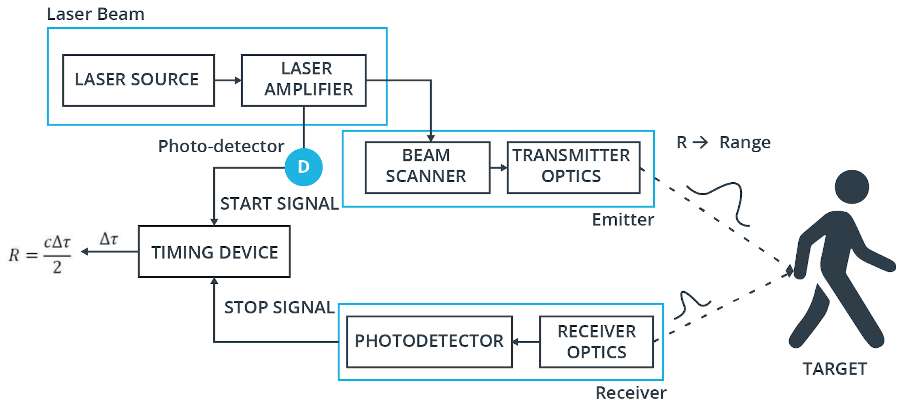

In the schematic, you can see the major parts `laser source`, `emitter`, `receiver` and `timer`. First, a very short pulse in the order of a few picoseconds or nanoseconds is generated by the laser source. The laser pulse is then amplified by the amplifier and then directed into the atmosphere with the help of a beam scanner and transmitter optics. Each pulse is directed to a specific location within the sensors field of view as it scans over the region of interest. A portion of the backscattered pulse energy that reaches the receiver lens is collected through the receiver optics, then amplified and converted to a voltage signal.

In order to accurately measure the time between beam emission and detection, a very precise clock is needed. As can be seen from the following figure, a leading edge thresholding technique is used on the voltage signal to detect the moment in time, when the laser pulse returns.

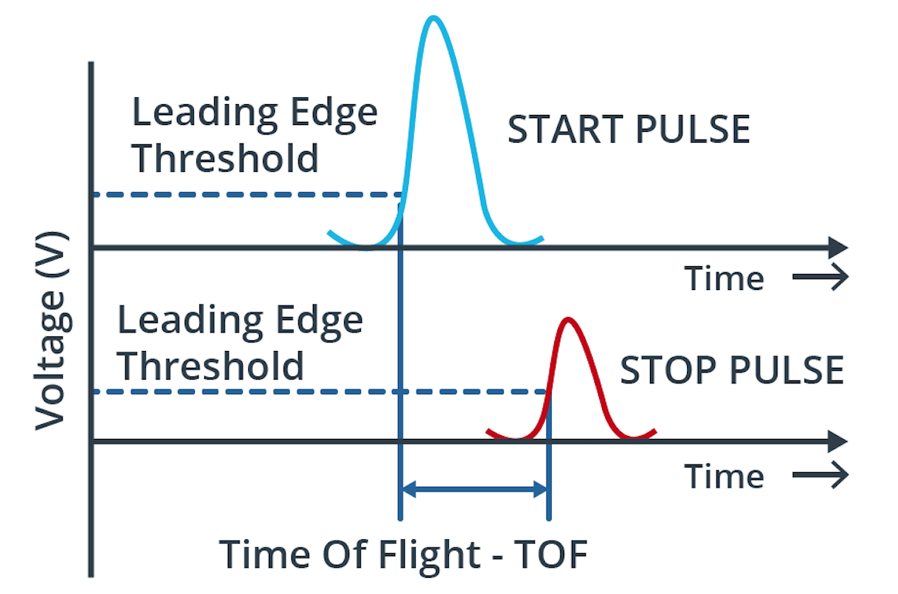

#### Range resoution

The attainable `range resolution is directly proportional to the resolution of the timing device`. A typical resolution value of the time interval measurement can be assumed to be in the 0.1 ns range, which results in a range resolution of 1.5 cm.

假設測量時間分辨率的值在 *0.1 ns* 範圍內，根據公式可得範圍分辨率為 *1.5 cm*。

```
R = 1/2 * 2.99 x 10^8 * 0.1 x 10^-9
  = 0.15 * 10^-1 (m)
  = 1.5 cm
```

#### Maximum range

The `maximum range` at which a target can be detected is mainly determined by the energy losses of the laser beam during its travel through the atmosphere. The lower the return energy and the higher the ambient noise, the harder it is for the receiver to detect a clear flank. `The ratio between signal energy and background noise is described by the signal-to-noise-ratio (SNR)`, which is shown for several signals returned from targets at varying distances.

如先前所說，`空氣中的環境也會影響LiDAR可檢測到目標的最大範圍`。
主要取決於Laser在穿過大氣時的能量損失，返回的能量越低，帶表環境的噪音越大，就越難檢測到清晰的側面。

信號能量和背景噪聲之間的比率由訊噪比(SNR)描述，當比率超過1:1(0 dB)，
表示訊號大於雜訊，可推得SNR越大越好。


It can also be seen from the figure, that the signal peaks flatten out in proportion to the target distance, which is caused by a lack of beam coherence. This effect is referred to as `beam divergence` and it is directly proportional to the wavelength λ of the laser light. For *`a LiDAR with λ=1550nm`* for example, the smallest resolvable feature size in lateral direction due to beam divergence is *`≈4cm` at a distance of 100m*. Just for comparison, a *`77GHz radar sensor with a wavelength of λ=0.3cm`*, the smallest resolvable feature size at the same distance is *`2m`*.

Also, as can be seen from the figure, the signal peak SNR decreases with increasing distances, which is caused by particles (such as water or dust) in the atmosphere that obstruct the laser path. *An in-depth analysis of the performance degradation of LiDAR under the influence of fog and rain can be found in* [*this paper*](https://arxiv.org/pdf/1906.07675.pdf).

There are two basic solutions for improving the SNR, which are

- (a) to `increase the laser energy`
- (b) to `increase the sensitivity of the receiver to detect weak signals in the presence of noise`.

While (a) is limited by the regulations on eye-safety, the approach (b) adds on significant complexity to the receiver electronics.

Another factor to be considered concerning maximum range is signal ambiguity, which states that `at each point in time, there should be only a single laser pulse "in flight" so that the received pulse can be unambiguously associated with the previously emitted pulse`.

Despite of the discussed limitations, time-of-flight pulsed LiDAR systems are the most frequently selected type (at present) for use in autonomous vehicles, mainly due to their simplicity and their capability to perform well outdoors, even under challenging environmental conditions.

Other time-of-flight methods are radar and ultrasound. Of these three ToF techniques, LiDAR provides the highest angular resolution, because of its significantly smaller beam divergence. It thus allows a better separation of adjacent objects in a scene, as illustrated in the following figure:

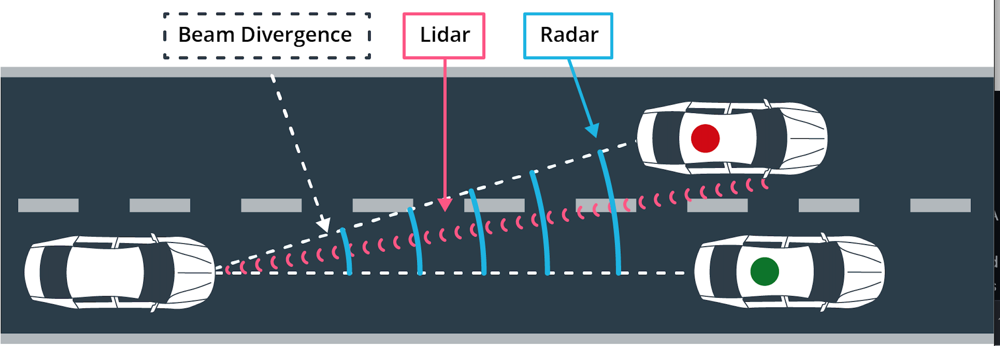

With currently available LiDAR systems however, the maximum range at which objects can be detected is still inferior to radar, which limits the speed at which LiDAR can be used as a primary sensing device (e.g. in highway scenarios).

## The LiDAR Equation

In the last section, we have looked at the basic working principle of a `time-of-flight pulsed LiDAR`. You now know that two of the challenging factors which influence the detection quality of a LiDAR system are:

- (a) `beam coherence`
- (b) `signal-to-noise ratio(SNR)`.

In this section, you will be briefly introduced to the so-called "LiDAR equation", which relates the power of a laser beam returned to the receiver with a number of factors, such as the transmission power in the sender, the target reflectivity and the atmospheric conditions between the optics and the target.

Please note that there is not "one" LiDAR equation but several, depending on the area of application. `In automotive sensing, the following equation is used most frequently`:

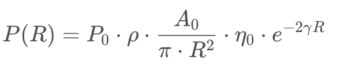

Let us take a quick look at the individual parameters and their respective implications for autonomous driving:

- `P(R)`: *power received* -> As can easily be seen, we want to maximize this expression for a high signal-to-noise-ratio (SNR) and thus a stable and accurate detection of the reflected laser pulse.
- `P_0`: *peak power transmitted* -> The more power used in the amplifier, the more photons will make it back to the receiver. There are two limiting factors which govern this parameter, which are eye safety regulations and power consumption.
- `ρ`: *target reflectivity* -> The more reflective the target surface is, the more photons will return to the receiver. The following diagram shows the reflectivity for a series of cotton samples worn by a pedestrian mannequin:

    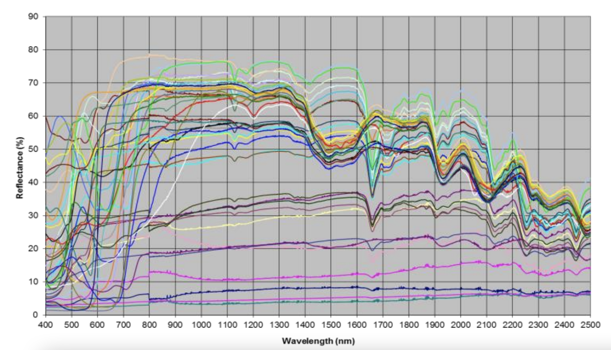

    As can be seen in the diagram, the reflectance varies significantly between the various samples (each cotton type is represented by an individual color). Also, reflectivity varies with the wavelength of the emitted laser light: `For most materials, reflectivity is between 50 and 70% at a wavelength of around 1000nm and decreases to around 20-40% for 2500nm. A perfect reflection with no power loss would obviously be 100%`.

    ```
    反射率：
      - 1000nm左右: 50-70%
      - 2500nm: 20-40%
    ```

- `A_0`: *receiver aperture area* -> As with classical photography, the size of the aperture directly influences the amount of light passing through to impact onto the receiver. The larger the aperture, the higher the number of returning photons will be. (孔徑越大，返回的光子數就越多)
- `η_0`: *transmission coefficient of receiver optics* -> When passing through a non-vacuum medium, photons are scattered due to obstructions in their flight path. The transmission coefficient indicates the degree of scattering, which the returning photons experience on their path through the optics. The more photons are lost, the fewer arrive at the receiver, which lowers the signal voltage level and thus the SNR.
- `γ`: *atmospheric extinction coefficient* -> Similar to the optics transmission coefficient, the atmospheric extinction coefficient describes the amount of photon loss due to collisions with airborne particles in the atmosphere, such as water molecules or dust. The more particles are in the air, the fewer photons return to the receiver, which also lowers the SNR.

Based on these parameters, you can develop an idea of how the various components from laser beam generation to photon detection influence the amount of received power and thus the signal-to-noise ratio.

### Multiple Signal Returns

You might have noticed the entry `ri_return2` in the previous section on the structure of Waymo frames. This data structure holds a "second return" of the LiDAR beam, which arrives after the first (i.e. primary) return. As the laser beam has a finite diameter, it is very well possible that only part of it is reflected by an object, especially when the laser strikes near a depth discontinuity, such as the edge of a vehicle. In the following figure, the laser beam first strikes the preceding vehicle on its left side, generating the first return. However, as the target has been hit only partially by the beam, a fraction of laser light continues in its path until it eventually strikes another target, which, in this case, is another vehicle. The return signal, which is usually weaker than the primary return due to the higher distance, arrives at the receiver after the primary return signal, hence the name "second return".

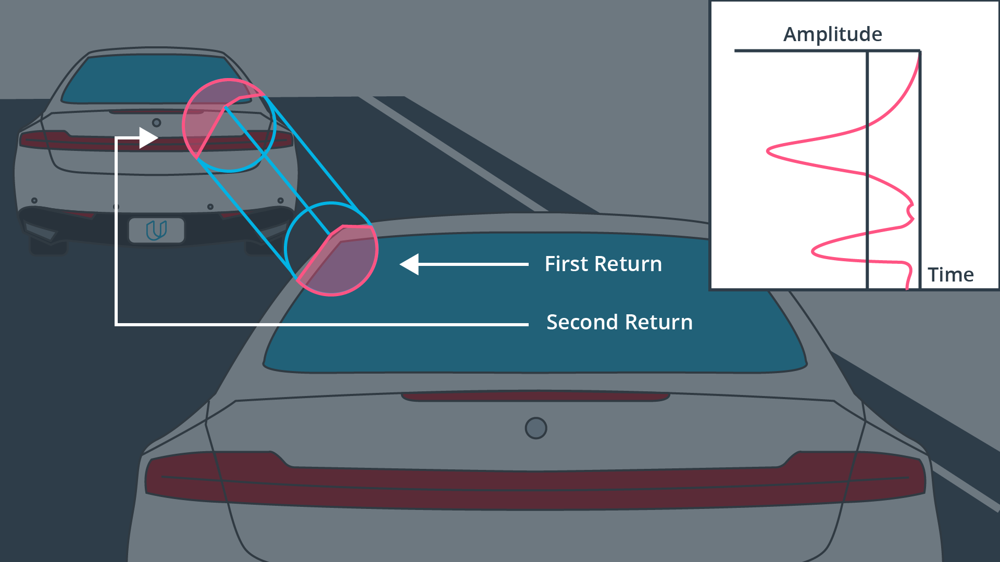

In this course though, we will not be using the ri_return2 structure from the Waymo dataset, but in principle it could be leveraged to detect object more accurate boundaries, similar to edge detection techniques used in computer vision

## LiDAR Types

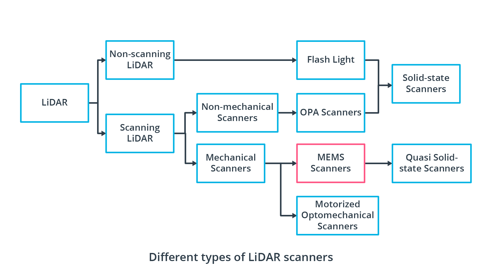

### 1. Scanning LiDAR - Motorized Opto-Mechanical Scanning

Motorized optomechanical scanners are the most common type of LiDAR scanners. In 2007, the company Velodyne, a pioneer in LiDAR technology, released a 64-beam rotating line scanner, which has clearly shaped and dominated the autonomous vehicle industry in their early years. The most obvious `advantages` of this scanner type are its `long ranging distance`, the `wide horizontal field-of-view` and the `fast scanning speed`.

With most sensors of this type, there are several transmitter-receiver channels, which are stacked vertically and rotated by a motor to create a 360° field-of-view.

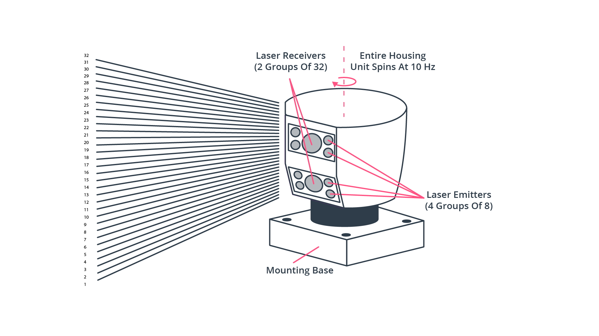

Even though the resulting point-cloud enables a high-quality object detection around the vehicle, there are several `significant drawbacks` of this scanner type. There are (a) `a high power consumption`, (b) `susceptibility to vibration and mechanical shocks`, (c) `a bulky package` and (d) - in most cases - `a very high price`. Also, due to the limited number of vertically stacked laser LEDs, (e) `their vertical resolution is limited`. However, there are several companies world-wide that aim at mitigating these drawbacks while maintaining the high-quality point-clouds that this sensor class is able to produce. The following figure shows a product line-up of Velodyne LiDARs, which illustrate the evolution of package size:

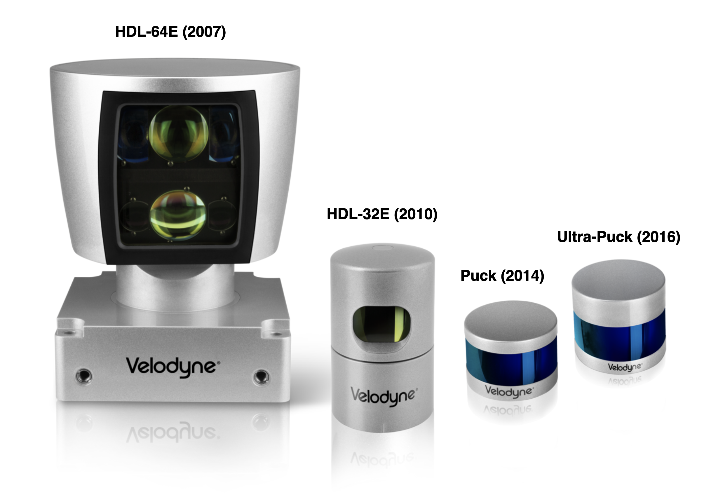

### 2. Non-Scanning Flash LiDAR (solid-state LiDAR)

This LiDAR type does not perform a sequential reconstruction of a scene by redirecting laser beams but instead `illuminates everything at once, similar to a camera using a flash-light`. Within such a `flash LiDAR`, an array of photodetectors simultaneously picks up the time-of-flight of each individual laser beam, providing a series of depth images where each pixel has been captured at the same time instant. As there are no moving parts, this sensor type is also referred to as `"solid-state LiDAR"`.

Since this method captures the entire scene in a single image compared to the mechanical laser scanning method, the data capture rate is much faster. Also, as each image is captured in a single flash, this scanning type achieves a higher robustness towards vibrations, which could otherwise distort the scanning process. The following figure visualizes the basic principle and compares it to the standard line-scanning technique we have already discussed previously as well as to a sequential raster-scanning technique in two dimensions.

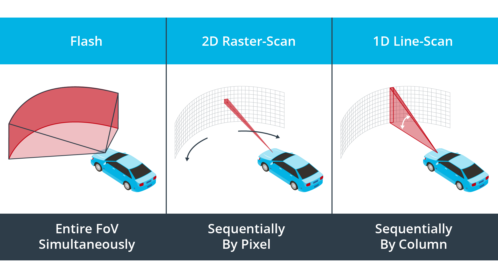

A downside of flash LiDAR is that `the amount of energy required to light the scene is comparatively high` as the entire scene is illuminated at once. Reducing the power to acceptable levels leads to a degradation of the SNR of the return signal, which severely limits the range at which targets can be detected.

A downside to this method is the presence of retroreflectors in the real-world environment. Retroreflectors reflect most of the light and back-scatter very little, in effect blinding the entire sensor and rendering it useless. Another disadvantage to this method is the very high peak laser power needed to illuminate the entire scene and see far enough.

### 3. Optical phase array (OPA)

Another sensor type belonging to the class of solid-state sensors is the Optical Phased Array (OPA) LiDAR. Other than flash LiDAR though, this sensor belongs to the class of scanning LiDARs, as the position of laser beam in the scene is actively directed. In an OPA system, an optical phase modulator is used to control the speed of light passing through the lens. OPA systems are able to shape the wave-front by delaying individual beams by varying amounts, which effectively steers the laser beam into different directions.

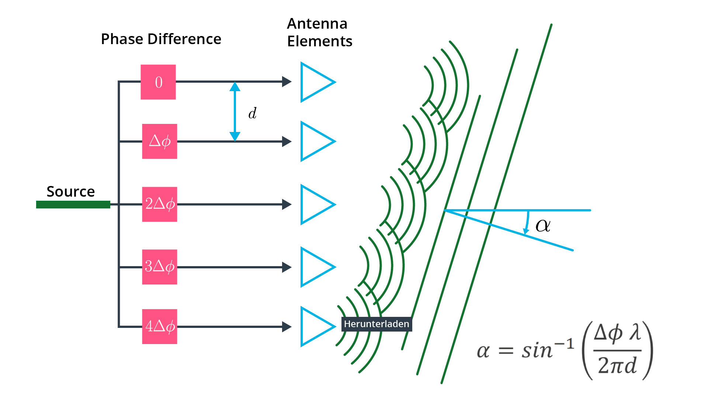

In the schematic, there are multiple emitters, from which light waves with carefully controlled phase differences are emitted. As can be seen, the resulting combined wave front propagates in a direction `α`, which depends on the wavelength of the light, on the phase difference `Φ` between the emitters as well as on their spatial distance `d`.

Even though the OPA technology is very promising, it belongs to the least-developed types yet and has not been used on any meaningful scale in automotive applications. Also, at this point, beam steering with most OPA systems works only in a single plane, which effectively corresponds to the functionality of a line-scanner. Two-dimensional beam steering is possible though, but requires a significant research and development effort.

### 4. MEMS Mirror-Based Quasi Solid-State LiDAR

Lastly, there is another type of scanning LiDAR, which is a hybrid between the solid-state flash and OPA LiDARs and the motorized opto-mechanical scanner: A Micro-Electro-Mechanical Systems (MEMS) LiDAR system uses tiny mirrors whose tilt angle varies when applying a voltage. They thus substitute the mechanical scanning hardware with an electromechanical equivalent on the silicon.

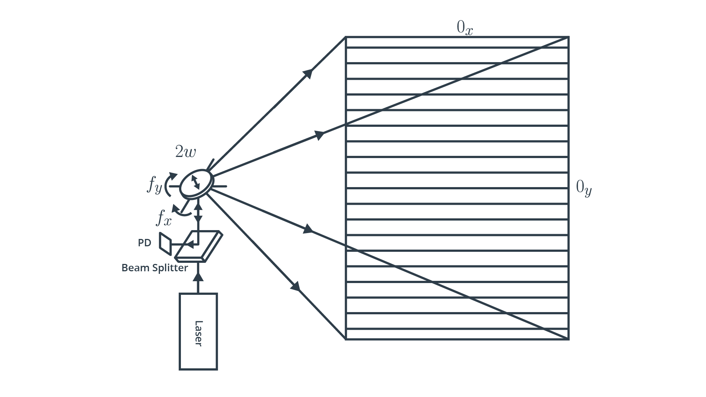

The following figure shows an example of a MEMS mirror:

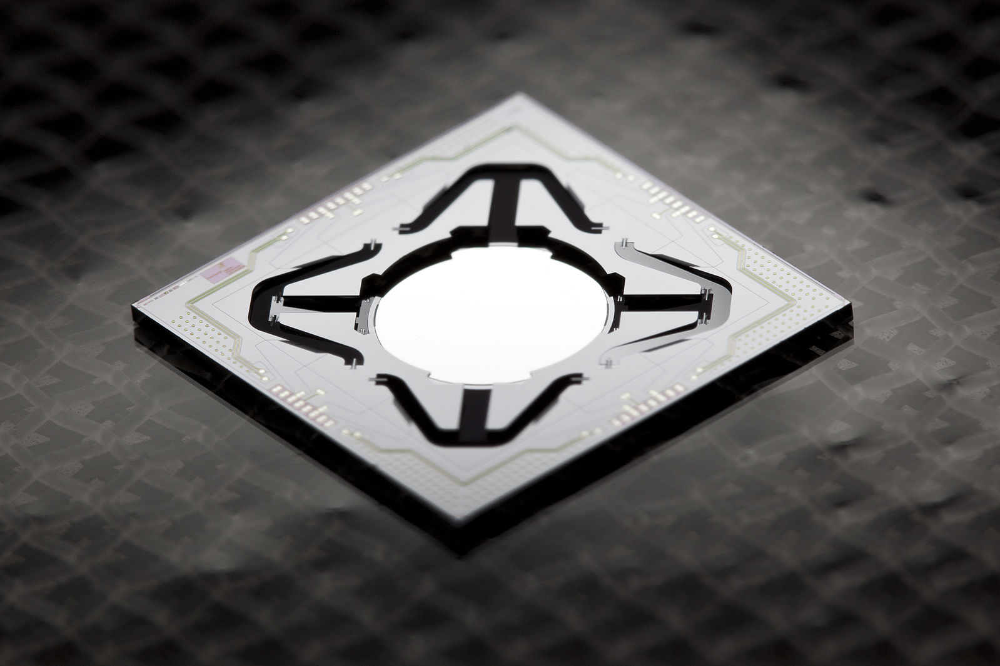

MEMS mirrors are able to steer and modulate the light source and even control its phase. Compared to motorized scanners, MEMS scanners are superior in terms of size, scanning speed and also cost. Instead of moving the entire LiDAR unit, a MEMS device only needs to rotate the tiny mirror plates (whose diameter is in the range of 1–9 mm), while the rest of the system remains stationary. Due to the low moment of inertia of the tiny mirrors, a two dimensional scan over the entire field of view can be performed in a small fraction of a second, which is a clear advantage with regard to the real-time requirements of autonomous vehicles.

Unlike a spinning LiDAR though, MEMS LiDAR systems have a limited field of view both in horizontal and in vertical directions, so multiple units have to be combined to generate a 360° scan. Also, due to the small size of the mirrors, beam divergence is higher for MEMS LiDARs, which currently limits their use to short-range applications mostly. As with OPA LiDARs, there are several start-up-companies working on improving MEMS LiDARs in the automotive context.

### 5. Frequency-modulated continuous wave (FMCW) LiDAR

While the methods listed so far are based on the time-of-flight principle using narrow light pulses, FMCW LiDAR sends out a constant stream of light (i.e. “continuous-wave”) and changes the frequency of that light at regular intervals (i.e. “frequency-modulated”). By measuring the phase and frequency of the returning light, an FMCW system is able to measure both distance (up to 300m) and velocity (by exploiting the Doppler effect). The following figure illustrates the principle:

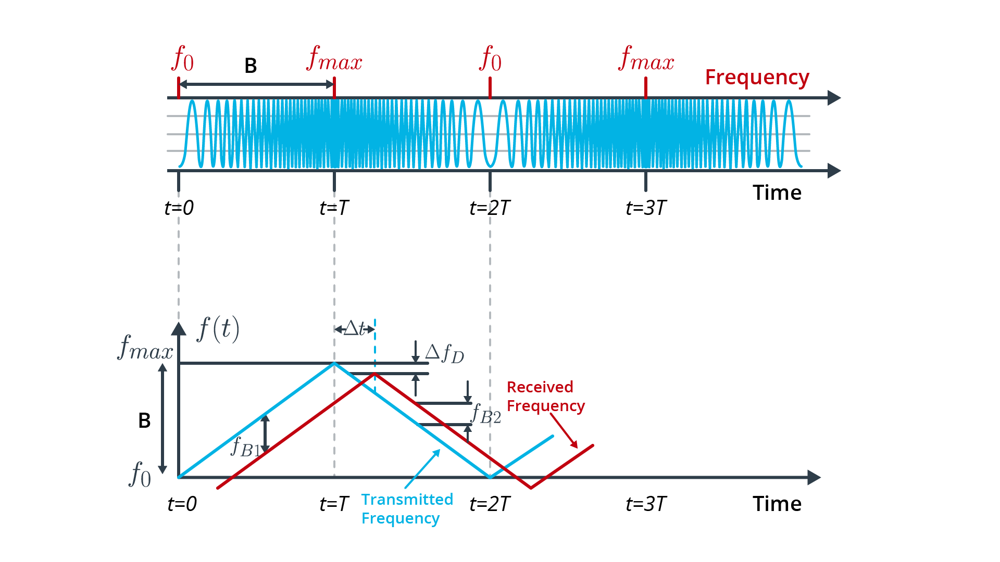

Assume the wave emitted at t = 0 encounters an object located at a range R moving at with a velocity of v_r . After a time $\Delta_t = \frac{2R}{c}$, the reflected wave reaches the transmitter-receiver, where it interferes with the wave emitted at that instant. The received wave will have a different frequency than the wave emitted at that instant due to two factors: the round-trip travel time $\Delta_t$ determined by the range R of the object and the Doppler shift $\Delta f_D$ due to the wave being reflected from an object moving at relative velocity. From the interference of the two waves, one can determine simultaneously both range and radial velocity of the object.

Today's time-of-flight LiDAR (ToF) systems operate at wavelengths of 850 and 905 nm, which are very close to the visible light spectrum. On the one hand, protection of the eyes from radiation damage is a major concern, but on the other hand, this limits both the maximum laser power and the range of the systems. In addition, there is significant solar radiation in the range of 850 to 905 nm, which causes interference in daylight. FMCW systems on the other hand use a wavelength of 1550 nm, which means far fewer concerns with regard to eye safety and less interference from solar radiation.

While FMCW LiDAR sensors have a great future ahead of them, they are still in an early development stage as of 2020. Until they reach maturity, the standard time-of-flight systems will remain the best choice for autonomous vehicles.

## LiDAR Selection Criteria

- `Eye Safety`

    As LiDAR sensors shoot laser beams into the atmosphere, it must be ensured that they are not harmful to the naked eye. As you have seen in the previous section, there are three factors which influence eye safety, which are (a) emitter power, (b) pulse duration and (c) light frequency. Eye safety standards categorize LiDAR sensors based on their output optical power level. `For automotive applications, LiDAR sensors must either be classified as a Class 1 or Class 1M laser safety level`.

- `Field of View (FOV)`

    Autonomous vehicles must perceive their environment in a 360° circumference. Also, it must be ensured that the entire driving corridor with respect to the vehicle's height is observed. Both of these observations result in two parameters, which are the `horizontal field-of-view (HFOV)` and the `vertical field-of-view (VFOV)` of a sensor. If we consider the classic *Velodyne HDL 64E LiDAR, the HFOV is at 360° and the HFOV is at 26.9°*, which, from a roof-mounted position, is sufficient to scan the environment from close to far range. Instead of using a single sensor though, multiple sensors with overlapping FOV may be used to complement each other. In Waymo vehicles, for example, the three LiDAR sensors at the front with a comparatively narrow but overlapping HFOV are used to observe the front and side of the vehicle at close-range.

- `Angular resolution`

    A critical parameter which controls the density of the point-cloud is the angular resolution of a LiDAR sensor. It defines the number of laser beams the sensor can project into its FOV. *For the Velodyne HDL 64E with its 64 individual beams, the vertical resolution is at ≈0.4° while the horizontal resolution is at ≈0.8°* based on the number of scans over a full rotation of the mirror. In order to track features such as curb-sides or a bicycle frame, a very fine angular resolution both in the horizontal and vertical direction are needed.

- `Number of points`

    Based on the angular resolution and the field-of-view, the number of 3d points can be calculated which the sensor returns over a full scanning cycle.

    ```
    Compute the number of points
    generated by the Velodyne HDL 64E during one full rotation
    of the sensor at an angular resolution of 0.08 degrees.
    Assume that every laser beam returns to the sensor.

    Ans: 64 * 360 / 0.08  = 288000
    ```

- `Frame rate`

    `The frame rate of a LiDAR sensor provides the number of full sweeps over both the HFOV and the VFOF`. In case of the Velodyne HDL 64E, the frame rate can be adjusted between 5Hz and 20Hz, depending on the requirements of the application and on the number of points that the respective system can handle performance-wise. Other than with the frame rate of a camera though, LiDAR measurements might not be performed at the same time instant. As the sensor sweeps across the scene, moving objects change their position, which results in smeared and potentially elongated objects, which have to be corrected before processing them. For solid-state LiDAR sensors however, this is not the case.

    ```
    Compute the number of points
    generated by the Velodyne HDL 64E in a second
    if you assume a scanning frequency of 5 Hz
    and an angular resolution of 0.08 degrees.
    Assume that every laser beam returns to the sensor.

    Ans: (64 * 360 / 0.08) * 5 = 1440000
    ```

- `Maximum range`

    Depending on the relative speed between LiDAR sensor and targets, you need to decide on the maximum range at which objects can still be detected with a sufficiently high probability. In LiDAR data sheets, you will find information on the maximum range of the respective sensor. However, you can not expect that the type of target you are looking for will actually be detected in a stable manner at maximum range. The reason for this can be explained by the way target measurements are performed by the LiDAR manufacturer: When assessing the range scanning capabilities of a sensor, a set of known targets with `specific reflectance parameters` will be used. Typically, `a reflector is characterized as "poor", when its reflectance is below 10% and as "good", when reflectance exceeds 90%`. In most cases, the target reflectance which has been used to define the maximum range will be specified in the data sheet.

- `Range resolution`

    Based on factors such as return signal strength, receiver sensitivity and the resolution of the timing device, the range resolution provides the smallest change in target distance, that is still perceivable by the LiDAR system.

    Other common parameters are e.g. "Pulse Repetition Rate (PRR) or Frequency (PRF)", the "Peak Power" and "Average Power" as well as the "Wavelength" of the laser beam.
