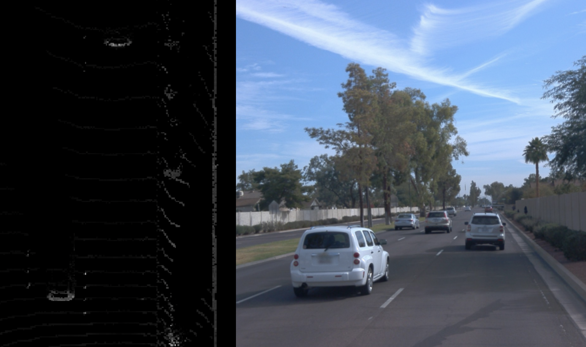
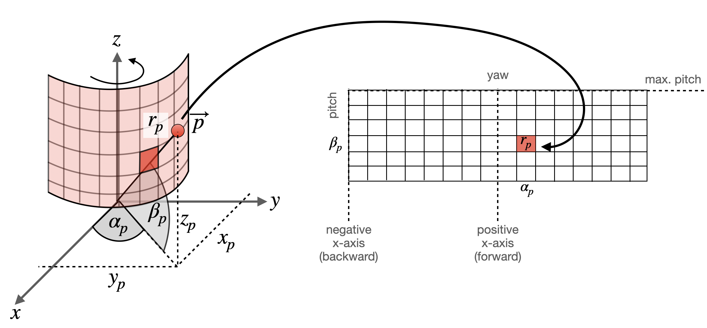
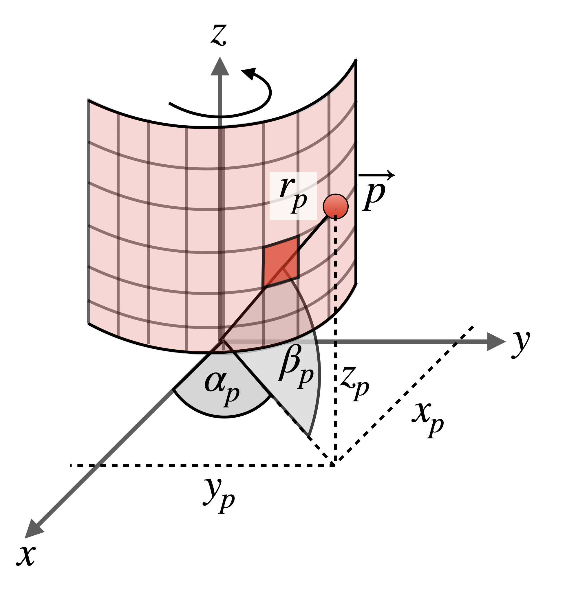
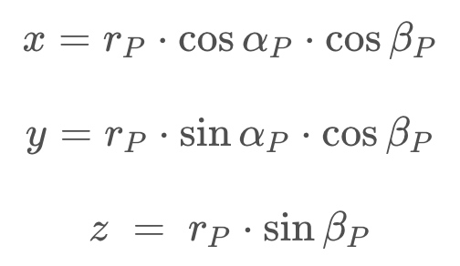
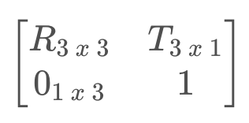
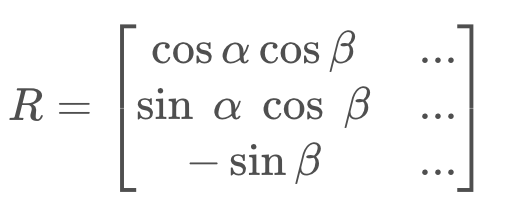
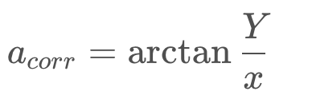

# Range Images

## What are Range Images (距離影像)

### 1. 3D Point Cloud

Typically, the sensor data provided by a lidar scanner is represented as a `3d point cloud`, where each point corresponds to the measurement of a single lidar beam. Each point is described by a coordinate in `(x, y, z)` and additional attributes such as `the intensity of the reflected laser pulse `or even a `secondary return caused by partial reflection at object boundaries`.

```
3D point cloud 中儲存每個點的三維座標(x,y,z)
及其他額外屬性，如: 反射的強度，二次回波等等的。
```

In the following figure, a point cloud is shown where the brightness of a 3d point encodes the intensity of the laser reflection.



As can be seen, the rear sections of the preceding vehicles and the wall on the right side are clearly visible with high intensity values in the birds-eye-view on the left, whereas the road surface or even the side of the vehicle in the center lane do hardly register at all.

### 2. Range Images (Depth Images)

An alternative form of representing lidar scans are `range images`. `This data structure holds 3d points as a 360 degree "photo"` of the scanning environment with the `row dimension` denoting the `elevation angle` of the laser beam and the `column dimension` denoting the `azimuth(方位角)`. With each incremental rotation around the z-axis, the lidar sensor returns a number of range and intensity measurements, which are then stored in the corresponding cells of the range image.

```
將從採集器到場景中個點的距離值作為像素值的圖像
它直接反應了景物可見表面的幾何形狀。
```

In the figure below, a point $\vec p$ in space is mapped into a range image cell, which is indicated by the corresponding `azimuth angle` $\alpha_p$ and the `inclination(傾角)` $b_p$ of the sensor. In the literature, $\alpha_p$ is often referred to as `yaw` whereas $b_p$ is called `pitch`.

```
Range Image: Row and Column

- Row: 仰角 (belta, pitch)
- Column: 方位角 (alpha, yaw)
```

In this example, only the range (i.e. the target distance) of $\vec p$ is stored in the cell. *However, in the Waymo dataset, the range image structure stores `range`, `intensity`, `elongation` and the `vehicle pose` at the time the measurement was created*.



#### Elongation (點雲延伸率)

The `elongation` of the laser pulse beyond its nominal width in conjunction with the intensity can be useful for classifying atmospherical conditions such as rain, fog or dust. Experiments conducted by Waymo suggest that a signal with high elongation and low intensity suggests the presence of atmospherical hazards.

LiDAR超出其標稱寬度的延伸與Intensity(強度)一起可用於對大氣條件進行類，如:`高延伸率但是低強度(低反射)的點一般為灰塵、霧、雨`。Waymo 進行的實驗表明，具有高伸長率和低強度的信號表明存在大氣危害。

Now that you have a first understanding of the concept of range images, let us visualize them properly.

## Visualizing Range Images

請按照以下順序練習:

1. `Load range image`: [l1_examples - load_range_image](https://github.com/kaka-lin/nd013-c2-fusion-exercises/blob/main/lesson-1-lidar-sensor/examples/l1_examples.py)

    In the example, output is `(64, 2650, 4)`, we now know that a `range image has 64 lines and 2650 columns`. From the previous section, we know that the top lidar covers a horizontal angle of 360°. This means that each column in the range image covers an arc of $\frac{360°}{2650}$ = 0.1358°,  which corresponds to a horizontal resolution of ≈8' angular minutes.

    In order to compute the vertical resolution, we need to make use of the minimum and maximum inclination (i.e. pitch).

2. `Calculate Pitch Resolution`: [l1_exercise - print_pitch_resolution](https://github.com/kaka-lin/nd013-c2-fusion-exercises/blob/main/lesson-1-lidar-sensor/exercises/starter/l1_exercises.py)

    Now that you are familiar with the resolution and basic structure of a range image, you will have a look at the data within the cells. From the documentation within dataset.proto (lines 174-178) we know that the inner dimensions of a range image cell are `[range, intensity, elongation, is_in_no_label_zone]`. In this course, we will focus on the first two entries, starting with the actual range information.

3. `Visualizing the range channel (range image)`: [l1_examples - vis_range_channel](https://github.com/kaka-lin/nd013-c2-fusion-exercises/blob/main/lesson-1-lidar-sensor/examples/l1_examples.py)

4. `Visualizing the intensity channel (intensity image)`: [l1_exercise - vis_intensity_channel](https://github.com/kaka-lin/nd013-c2-fusion-exercises/blob/main/lesson-1-lidar-sensor/exercises/starter/l1_exercises.py)

   - Note: 使用 `contrast adjustment` 來解決問題

        ```python
        ri_intensity = np.amax(ri_intensity)/2 * ri_intensity * 255 / (np.amax(ri_intensity) - np.amin(ri_intensity))
        ```

        Note that there is a single very bright pixel left of the center while the rest of the intensity map is mostly zero. The reason for this behavior of the scaling process is that the range of values extends over several powers of ten from the darkest to the brightest region. This is a common problem with Lidar data in an automotive context due to the presence of retro-reflective materials (e.g. some traffic signs, tail-lights, some license plates) in a typical scene. For such materials, the intensity of the reflected laser beam is significantly higher than for other materials. Therefore, if we were to normalize the data using standard approaches from the literature such as z-normalization or similar methods, we would succeed in mitigating the influence of "intensity outliers" but at the same time boost the noise level significantly.Therefore, a somewhat heuristic approach to this lidar-specific problem could be to simply multiply the entire intensity image with half the value of the max. intensity value. In computer vision, this operation would be termed "contrast adjustment".

## Converting Range Images to Point Clouds

In order to perform this spatial reconstruction, we simply need to invert the mapping process that we have discussed at the beginning of this chapter:



The datail code you can see [l1_examples - range_image_to_point_cloud](https://github.com/kaka-lin/nd013-c2-fusion-exercises/blob/main/lesson-1-lidar-sensor/examples/l1_examples.py).

Based on pitch and yaw angle as well as on the actual range of a point p, we can use the concept of [spherical coordinates(球座標)](https://en.wikipedia.org/wiki/Spherical_coordinate_system) to reconstruct the x, y and with components of p:



We need to extract the angles alpha_p and beta_p for each cell of the range image.

### 1. Extract the inclinations (pitch, bete_p)

As a first step, we extract the angles beta_p for each cell of the range image.

This can be accomplished by retrieving the max. and min. vertical beam inclinations from the lidar calibration data and by creating a linear space of values between the two based on the height of the range image:

```python
height = ri.shape[0]
inclination_min = calibration.beam_inclination_min
inclination_max = calibration.beam_inclination_max
# 在 min 跟 max 之間生成 height 個點
inclinations = np.linspace(inclination_min, inclination_max, height)
# reversed, in order so that
# the first angle corresponds to the top-most measurement.
inclinations = np.flip(inclinations)
```

Note that the inclinations have to be reversed in order so that the first angle corresponds to the top-most measurement.

### 2. Compute the correct azimuth angle (yaw)

As a next step, we need to correct the azimuth angle in such a way that the center of the range image corresponds to the direction of the forward-facing x-axis of the Waymo vehicle. To do this, we need to extract the [extrinsic calibration matrix](https://en.wikipedia.org/wiki/Camera_resectioning) of the top lidar sensor:



where:
- the matrixR_3x3: describes the rotation of the sensor around its three coordinate axes in relation to the superior coordinate system (e.g. the vehicle).
- the vectorT_3x1: denotes the relative center of the coordinate system.

The [rotation matrix](https://en.wikipedia.org/wiki/Rotation_matrix) is composed of a sequence of individual rotations around the axes of the coordinate system with the first column looking as follows:



When you compare the first and second component with the spherical coordinates transformation equations, you will notice that the first component corresponds to x and the second component to y. Therefore, in order to get the rotation angle of the coordinate system around the z-axis (which is the azimuth correction), we can use the following equation:



In code, the azimuth correction looks like the following:

```python
extrinsic = np.array(calibration.extrinsic.transform).reshape(4,4)
az_correction = math.atan2(extrinsic[1,0], extrinsic[0,0])
azimuth = np.linspace(np.pi,-np.pi,width) - az_correction
```

### 3. Compute the x, y and z coordinates

Next, we can use the following code to compute the x, y and z coordinates for each range image entry:

```python
# expand inclination and azimuth such that every range image cell has its own appropriate value pair
azimuth_tiled = np.broadcast_to(azimuth[np.newaxis,:], (height,width))
inclination_tiled = np.broadcast_to(inclinations[:,np.newaxis],(height,width))

# perform coordinate conversion
x = np.cos(azimuth) * np.cos(inclination) * ri_range
y = np.sin(azimuth) * np.cos(inclination) * ri_range
z = np.sin(inclination) * ri_range
```

Lastly, before we can properly use the point-cloud to e.g. detect objects, we need to transform all points, which are currently expressed within the sensor coordinate system, in vehicle coordinates.

To do this, we need to first add a fourth component to express them as [homogeneous coordinates](https://en.wikipedia.org/wiki/Homogeneous_coordinates) and multiply them with the extrinsic transformation matrix. In Python, this can be expressed efficiently using the [einsum function](https://rockt.github.io/2018/04/30/einsum), where the indices `i,j` represent the dimensions of the `extrinsic matrix` and `j,k,l` are the dimensions of the `range image` with a set of homogeneous coordinates per cell:

```python
xyz_sensor = np.stack([x,y,z,np.ones_like(z)])
xyz_vehicle = np.einsum('ij,jkl->ikl', extrinsic, xyz_sensor)
xyz_vehicle = xyz_vehicle.transpose(1,2,0)
```

The resulting structure `xyz_vehicle` contains the transformed vehicle coordinates with the fourth component being 1, which can thus be ignored. With the following code, all 3d points with a range greater than zero are extracted and visualized using the `open3d` toolbox:

```python
pcl = xyz_vehicle[ri_range > 0,:3]
pcd = o3d.geometry.PointCloud()
pcd.points = o3d.utility.Vector3dVector(pcl)
o3d.visualization.draw_geometries([pcd])
```
