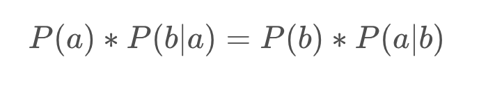
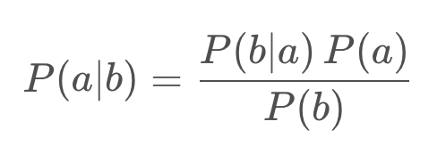
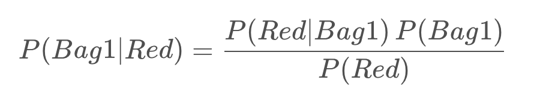

# Bayes' Rule

Recall that `Bayes' Rule` enables us to determine the conditional probability of a state given evidence `P(a|b)` by relating it to the conditional probability of the evidence given the state P(b|a) in the form of:



which can be rearranged to:



In other words the probability of state a, given evidence b, is the probability of evidence b, given state a, multiplied by the probability of state a, normalized by the total probability of b over all states.

`事件A在事件B的條件下發生的機率是`:

    事件B在事件A的條件下發生的機率 * 事件A發生的機率 / 事件B發生的機率

## Bayes' Rule Applied

Let's say we have two bags of marbles, bag 1 and bag 2, filled with two types of marbles, red and blue. Bag 1 contains 10 blue marbles and 30 red marbles, whereas bag 2 contains 20 of each color marble.

- bag1: 10 個藍色彈珠和 30 個紅色彈珠
- bag2: 20 個藍色彈珠和 20 個紅色彈珠。

If a friend were to choose a bag at random and then a marble at random, from that bag, how can we determine the probability that that marble came from a specific bag? You guessed it - `Bayes' Rule`!

如果隨機選擇一個袋子，然後從那個袋子中隨機選擇一個彈珠，我們如何確定該彈珠來自特定袋子的概率？

```
貝氏定理
```

In this scenario, our friend produces a red marble, in that case, what is the probability that the marble came from bag 1? Rewriting this in terms of Bayes' Rule, our solution becomes:

如果拿到一個紅色彈珠，那麼彈珠來自 bag1 的概率是多少？



```
P(bag1|red) = (P(red|bag1) * P(bag1)) / R(red)
            = (3/4 * 0.5) / (50/80)
            = 0.6
```

## Bayes' Filter For Localization

We can apply Bayes' Rule to vehicle localization by passing variables through Bayes' Rule for each time step, as our vehicle moves. This is known as a `Bayes' Filter for Localization`.

The generalized form Bayes' Filter for Localization is shown below. You may recognize this as being similar to a Kalman filter. In fact, `many localization filters, including the Kalman filter are special cases of Bayes' Filter`.


With respect to localization, these terms are:

1. `P(location∣observation)`: This is P(a|b), the normalized probability of a position given an observation `(posterior)`.

2. `P(observation∣location)`: This is P(b|a), the probability of an observation given a position `(likelihood)`

3. `P(location)`: This is P(a), the prior probability of a position

    ```
    P(location) is determined by the motion model.
    ```

    The probability returned by the motion model is the product of the transition model probability (the probability of moving from x_{t-1} --> x_t) and the probability of the state x_{t-1}

4. `P(observation)`: This is P(b), the total probability of an observation

## Bayesian Methods Resources

- [Sebastian Discusses Bayes Rule](https://www.youtube.com/watch?v=sA5wv56qYc0)
- [More Bayes Rule Content from Udacity](https://classroom.udacity.com/courses/st101/lessons/48703346/concepts/483698470923)
- [Bayes Rule with Ratios](https://betterexplained.com/articles/understanding-bayes-theorem-with-ratios/)
- [A Deep Dive into Bayesian Methods, for Programmers](https://greenteapress.com/wp/think-bayes/)
