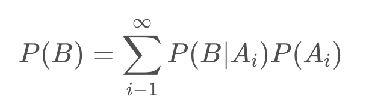
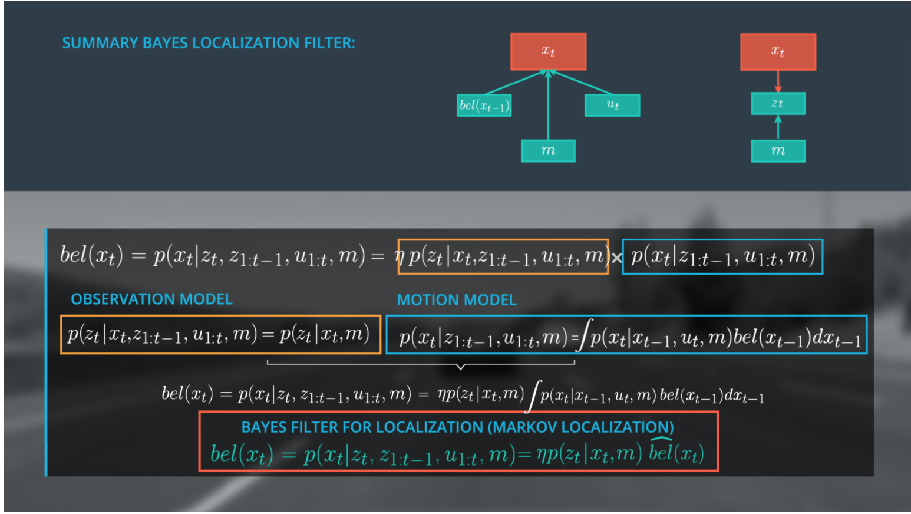

# Markov Localization

`Markov Localization`, or `Bayes Filter` for Localization, is a `generalized filter` for localization and all other localization approaches are realizations of this approach.

We don't know exactly where our vehicle is at any given time, but can approximate it' location. As such, *we generally think of our vehicle location as a probability distribution, each time we move, our distribution becomes more diffuse (wider) (分散，更廣泛)*. *We pass our variables (map data, observation data, and control data) into the filter to concentrate (narrow) (集中，縮小) this distribution*, at each time step. Each state prior to applying the filter represents our prior and the narrowed distribution represents our `Bayes' posterior`.


Summary, please see [here](#finalize-the-bayes-localization-filter)

## Localization Posterior


- `z1:t`: represents the observation vector from time 0 to t (range measurements, bearing, images, etc.).

- `u1:t`: represents the control vector from time 0 to t (yaw/pitch/roll rates and velocities).

- `m`: represents the map (grid maps, feature maps, landmarks)

- `xt`: represents the 2D pose (local coordinate)

    ```
    position (x,y) + orientation θ
    ```
    This value is unknown.

    我們永遠不會準確的知道 xt，what we want is to form a sufficiently accurate belief of the state xt.

- `bel(xt)`: belief of the state xt.

    And we want to formulate this belief in a `probabilistic` way -> `p(xt|z1:t, u1:t, m)`

- `p(xt|z1:t, u1:t, m)`: localization posterior.

我們要估計的是汽車的 local coordinate 與地圖的 global coordinate 之間的轉換，如果我們知道這個轉換，那麼我們就知道汽車在 map 中的位置

### Explanation and Implementation


### Bayes' Filter For Localization

Please see [here]().

### Calculate Localization Posterior

Let's walk through `calculations for determining posterior probabilities` at several pseudo positions x, for a single time step. We will start with a time step after the filter has already been initialized and run a few times. We will cover initialization of the filter in an upcoming concept.


其中:

- `Normalized P(location|observation)`:

    = `Raw P(location|observation) / P(observation)`

- `P(location∣observation)`: This is P(a|b), the `normalized` probability of a position given an observation (posterior)

```
P(observation∣location) for x = 4?

P(O|L) = P(L|O) * P(O) / P(L)

又: P(O) = RP(L|O) / P(L|O)

=> P(O|L) = (P(L|O) * (RP(L|O) / P(L|O))) / P(L)
          = RP(L|O) / P(L)
          = 5.42E-03 / 3.86E-02
          =  1.40E-1
```

### Initialize Belief State

Let's walk through the process of `initializing our prior belief state`. That is, what values should our initial belief state take for each possible position?

Let's say we have a 1D map extending from 0 to 25 meters. We have landmarks at x = 5.0, 10.0, and 20.0 meters, with position standard deviation of 1.0 meter. If we know that our car's initial position is at one of these three landmarks, how should we define our initial belief state?

Since we know that we are parked next to a landmark, we can set our probability of being next to a landmark as 1.0. Accounting for a `position precision of +/- 1.0 meters`, this places our car at an initial position in the range `[4, 6] (5 +/- 1)`, `[9, 11] (10 +/- 1)`, or `[19, 21] (20 +/- 1)`. *All other positions, not within 1.0 meter of a landmark, are initialized to 0*. *We normalize these values to a total probability of 1.0 by dividing by the total number of positions that are potentially occupied*.

In this case, that is 9 positions, 3 for each landmark (the landmark position and one position on either side). This gives us a value of `1.11E-01` for positions +/- 1 from our landmarks `(1.0/9)`. So, our initial belief state is:

`
{0, 0, 0, 1.11E-01, 1.11E-01, 1.11E-01, 0, 0, 1.11E-01, 1.11E-01, 1.11E-01, 0, 0, 0, 0, 0, 0, 0, 1.11E-01, 1.11E-01, 1.11E-01, 0, 0, 0, 0}
`

To reinforce this concept, let's practice with a example.

- `map size`: 100 meters
- `landmark positions`: {8, 15, 30, 70, 80}
- `position standard deviation`: 2 meters

    ```
    1. initial probability (initial belief state) for position 11: 0

    2. position 71: 1.0 / 25 = 4.00E-02
    ```

    因為有 5 個地標和 2 meter 的位置偏差，
    所以每一個 landmark 有 5 個可能的位置，
    總共就是 25 個。

### Initialize Priors Function

Please see [here](https://github.com/kaka-lin/nd013-c3-localization-exercises/tree/master/lesson-1-initialize-priors-function).

### How much data in z1:t

- with each refresh rate, LiDAR sends `100,000 data points`
- Each observation contain `5 pieces` of data (point id, range, 2 angles and reflectivity)
- Each piece of data requires `4 bytes`
- Drive for `6 hours`
- Lidar refreshes `10 times per second`

```
100000 * 5 * 10 * 6 * 60 * 60 * 4
= 432,000,000,000 (Bytes)
= 432000000000 / 1024^3 (GB)
= 402.3 (GB)
```

### Define Posterior in recursive way

如果你想跳過公式推導，請直接看 [summary](#recursive-structure)。

If we want to estimate the posterior directly, two problem:

- A LOT of data (100s of GBs per update)

    ```
    Does not work for a real time localizer at 10Hz
    ```
- A mount of data increases over time

We aim to estimate state beliefs `bel(xt)` without the need to carry our entire observation history

A recursive state estimator:


For this to work, we must demonstrate that our current belief `bel(xt)` can be expressed by the belief one step earlier `bel(xt−1)`, then *use new data to update only the current belief*.

This recursive filter is known as the `Bayes Localization filter` or `Markov Localization` that enables us to avoid carrying historical observation and motion data.


We will achieve this recursive state estimator using `Bayes Rule`, the `Law of Total Probability`, and the `Markov Assumption`.

Split a whole observation vector `(z1:t)` into:
- the current observations `(zt)`
- the previous information `(z1:t-1)`


Now, we apply `Bayes' rule`, with an additional challenge, the presence of multiple distributions on the right side:

- likelihood
- prior
- normalizing constant

#### Bayes Rule

P(a|b) is `P(xt|zt, z1:t-1, u1:t, m)`


- `Likelihood`: `Observation model`

    the probability distribution of the observation vector t.

- `Prior`: `Motion model`

    the probability distribution of xt given all observations from one to t minus one.


- Normalization term: `η (eta)`:

    sum of the product of the observation and the motion model over all possible state xt^(i).

This means, you only have to define the observation and motion model to estimate the beliefs.

#### Law of Total Probability




#### Markov Assumption

(a) Since we (hypothetically) know in which state the system is at time step t-1, the past observations *z1:t−1* and controls *u1:t−1* would not provide us additional information to estimate the posterior for *xt*, because they were already used to estimate *xt−1*. This means, we can simplify `p(xt∣xt−1, z1:t−1, u1:t, m) to p(xt∣xt−1, ut, m)`.

(b) Since *ut* is “in the future” with reference to *xt−1*,ut does not tell us much about *xt−1*. This means the term `p(xt−1∣z1:t−1, u1:t, m) can be simplified to p(xt-1|z1:t-1, u1:t-1, m)`.

##### The first order Markov Assumption


假設 x2 is the best prediction for x3,
and x1 is the best prdiction for x2, so:


We have to assume that we have an initial guess for x0, so x0 must be initialized correctly.

- Example:

    ```
    天氣預報

    明天的天氣取決於今天的天氣，
    且今天的天氣已經包含之前得資訊和 uncertain.
    ```

A Markov process is one in which the conditional probability distribution of future states (ie the next state) is dependent only upon the current state and not on other preceding states. This can be expressed mathematically as:


It is important to note that the current state may contain all information from preceding states.

So:


#### Recursive Structure


We have achieved a very important step towards the final form of our recursive state estimator. Let’s see why. If we rewrite the second term in our integral to `split z1:t-1 to zt−1 and z1:t−2` we arrive at a function that is exactly the belief from the previous time step, namely `bel(xt−1)`.


Now we can rewrite out integral as the belief of xt−1.


The amazing thing is that `we have a recursive update formula and can now use the estimated state from the previous time step to predict the current state at t`. This is a critical step in a recursive Bayesian filter because it renders us independent from the entire observation and control history. So in the graph structure, we will replace the previous state terms (highlighted) with our belief of the state at x at t−1 (next image).


Finally, we replace the integral by a sum over all xi because we have a discrete localization scenario in this case, to get the same formula in Sebastian's lesson for localization. The process of predicting xt with a previous `beliefs(xt−1)` and the transition model is technically a convolution. If you take a look to the formula again, it is essential that the belief at `xt = 0` is initialized with a meaningful assumption. It depends on the localization scenario how you set the belief or in other words, how you initialize your filter. For example, you can use GPS to get a coarse estimate of your location.


## Implementation Details for Motion Model


### Determine Probabilities

To implement these models in code, we need a function to which we can pass model parameters/values and return a probability. Fortunately, we can use a normalized `probability density function (PDF)`.

About `Gaussian Distribution` please see [here](https://github.com/kaka-lin/autonomous-driving-notes/blob/master/Sensor%20Fusion%20and%20Tracking/Kalman%20Filters/Gaussian/gaussian.md).


We have implemented this Gaussian Distribution as a C++ function, `normpdf`. `normpdf` accepts a value, a parameter, and a standard deviation, returning a probability. Please see [here](https://github.com/kaka-lin/nd013-c3-localization-exercises/tree/master/lesson-2-determine-probabilities).

#### Transition Model Probabilities

the probability of moving from x_t-1 to x_t. The value entered into `normpdf` will be `the distance between these two positions`. We will refer to the potential  values of these positions as `pseudo position` and `pre-pseudo position`.

For example:

```
pseudo position: 8
pre-pseudo position: 5
sample value: 3 (8 - 5)
transition: from x - 3 --> x
```

So:

```
Our value will always be maximized
when our parameter (mu) and value (x) are equal.
```

### Motion Model

Now we will implementing the `motion model` to `determine P(location)` for our `Bayesian filter`.

Recall that we derived the following recursive structure for the motion model:


and that we will implement this in the discretized form:


How is the summation doing that?

It's looking at each prior location where the vehicle could have been, x_{t-1}. Then the summation iterates over every possible prior location, $x_{t-1}^{(1)}...x_{t-1}^{(n)}$. For each possible prior location in that list, $x_{t-1}^{(i)}$, the summation yields the `total probability` that the vehicle really did start at that prior location `and` that it wound up at x_t.

That now raises the question, how do we calculate the individual probability that the vehicle really did start at that prior location and that it wound up at x_t, for each possible starting position $x_{t-1}$ ?

That's where each individual element of the summation contributes. The `likelihood` of starting at $x_{t-1}$ and arriving at $x_{t}$ is simply $p(x_t|x_{t-1}) * p(x_{t-1})$.

We can say the same thing, using different notation and incorporating all of our knowledge about the world, by writing: $p(x_t|x_{t-1}^{(i)}, u_t, m) * bel(x_{t-1}^{(i)})$

From the equation above we can see that our `final position probability is the sum of n discretized motion model calculations`, where each calculation is the product of the `'i'th transition probability`, $p(x_t|x_{t-1}^{(i)}, u_t, m)$, and `'i'th belief state`, $bel(x_{t-1}^{(i)})$. Let's try out a single, discreet calculation.

`'i'th Motion Model Probability:`


## Markov Assumption for Observation Model


The Markov assumption can help us simplify the observation model. Recall that the Markov Assumption is that the next state is dependent only upon the preceding states and that preceding state information has already been used in our state estimation. As such, we can ignore terms in our observation model prior to x_t since these values have already been accounted for in our current state and assume that t is independent of previous observations and controls.


With these assumptions we simplify our posterior distribution such that the observations at t are dependent only on x at time t and the map.


Since $z_t$ can be a vector of multiple observations we rewrite our observation model to account for the observation models for each single range measurement. We assume that the noise behavior of the individual range values $z_t^1$ to $z_t^k$ is independent and that our observations are independent, allowing us to represent the observation model as a product over the individual probability distributions of each single range measurement. Now we must determine how to define the observation model for single range measurement.


Example, we assume:

- standard deviation: 1 meter
- Range spectrum: 0 - 100 meters

If our car is standing at position 20 it would make use $x_t$, and m to make `pseudo range` ($z_t^*$) observations in the order of the first landmark to the last landmark or 5, 11, 39, and 57 meters. Compared to our real observations (z_t = [19, 37]) the position x_t = 20 seems unlikely and our observation would rather fit to a position around 40.

假設車子位於 20m 處，且首先觀察到 5m，然後 11、39、和 57 米處的地標，和真正的觀察相比這位置似乎是不對的，因為看起來我們的觀察更接近在 40m 處。

Based on this example the observation model for a single range measurement is defined by the probability of the following normal distribution:

$p(z_t^k|x_t )\tilde\ N(z_t^k,z_t^{*k},\sigma z_t)$

where $z_t^{*k}$ is the mean.

### Implementing the observation model


- pseudo position: x = 20m
- vector of landmark positions from our map: [9, 15, 25, 31, 59, 77]
  - pseudo range estimates: [5, 11, 39 ,57]
- observation measurements: [19, 37]
- observation standard deviation: 1.0m

The observation model will be implemented by performing the following at each time step:

- Measure the range to landmarks up to 100m from the vehicle, `in the driving direction (forward)`

- `Estimate a pseudo range`:

    Estimate Pseudo Ranges from each landmark by subtracting pseudo position from the landmark position

    ```
    只看在車子前方的, x=20:
    -> [25-20, 31-20, 59-20, 77-20]
    -> pseudo range estimates: [5, 11, 39 ,57]
    ```

- `Assoiation`:

    Match each pseudo range estimate to its closest observation measurement

    ```
    pseudo range estimates: [5, 11, 39 ,57]
    observation measurements: [19, 37]

    -> (observation,pseudo_range) = [(19,11),(37,39)]

    ```

- `Determine Probabilities`:

    For each pseudo range and observation measurement pair, calculate a probability by passing relevant values to norm_pdf: `norm_pdf(pseudo_range_estimate, observation_measurement, observation_stdev)`

    ```c
    // (observation,pseudo_range)= [(19,11),(37,39)]

    // 11 or 39
    float value = 11.0 // distance between x_t and x_t-1

    // 19 or 37
    float parameter = 19.0 // observation measurement
    float stdev = 1.0; //position or observation standard deviation

    norm_pdf(pseudo_range_estimate, observation_measurement, stdev)
    ```

- `Observation Model Probability`:

    Return `the product of all probabilities`

    ```
    product of each observation probability from the norm_pdf()
    ```

## Finalize the Bayes Localization Filter

Implementing please see [here](https://github.com/kaka-lin/nd013-c3-localization-exercises/tree/master/lesson-8-coding-the-full-filter).



We have accomplished a lot in this lesson.

- Starting with the `generalized form of Bayes Rule`, we expressed our posterior, the belief of x at t as η (normalizer) multiplied with the observation model and the motion model.
- We simplified the observation model using the `Markov assumption` to `determine the probability` of z at time t, given only x at time t, and the map.
- We expressed the `motion model` as a `recursive state` estimator using the `Markov assumption` and `the law of total probability`, resulting in a model that includes our belief at t – 1 and our transition model.
- Finally we derived `the general Bayes Filter for Localization (Markov Localization)` by expressing our belief of x at t as a simplified version of our original posterior expression (top equation), `η` multiplied by the `simplified observation model` and `the motion model`.

    Here the motion model is written as $\hat{bel}$, a `prediction model`.


The Bayes Localization Filter dependencies can be represented as a graph, by combining our sub-graphs. To estimate the new state x at t we only need to consider the previous belief state, the current observations and controls, and the map.


It is a common practice to represent this filter without the belief x_t and to remove the map from the motion model. Ultimately we define bel(x_t) as the following expression.


### Summary


The image above sums up the core achievements of this lesson.

- The Bayes Localization Filter Markov Localization is a general framework for recursive state estimation.
- That means this framework allows us to use the previous state (state at t-1) to estimate a new state (state at t) using only current observations and controls (observations and control at t), rather than the entire data history (data from 0:t).


- The motion model describes the prediction step of the filter while the observation model is the update step.
- The state estimation using the Bayes filter is dependent upon the interaction between prediction (motion model) and update (observation model steps) and all the localization methods discussed so far are realizations of the Bayes filter.
