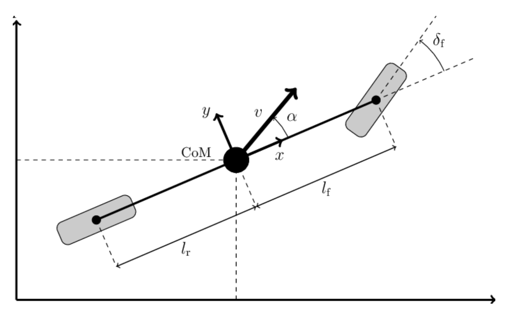

# Motion Models

## Bicycle Model

The bicycle model is a simple and useful way to represent how car moves.

[reference](https://www.researchgate.net/figure/Qualitative-illustration-of-the-dynamic-bicycle-model-the-vehicle-velocity-body-slip_fig1_329133218)
