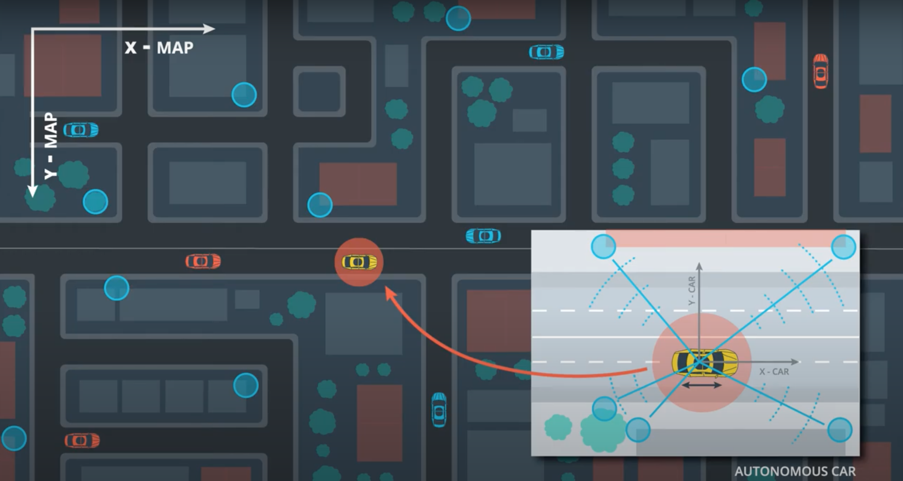

# Localization



```
Where is our car in a given map
with an accuracy of 10cm or less ?

Onboard sensors are used to estimate
transformation between measurements
and a given map.
```

## Markov Localization

Please see [here](Markov%20Localization/README.md)

## Scan Matching

Please see [here](Scan%20Matching/README.md)
