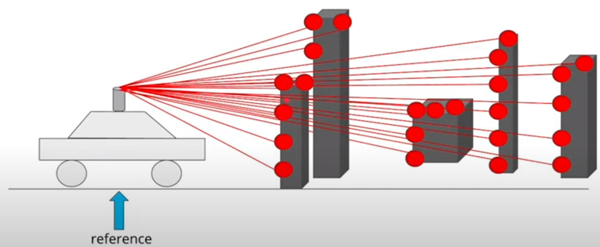
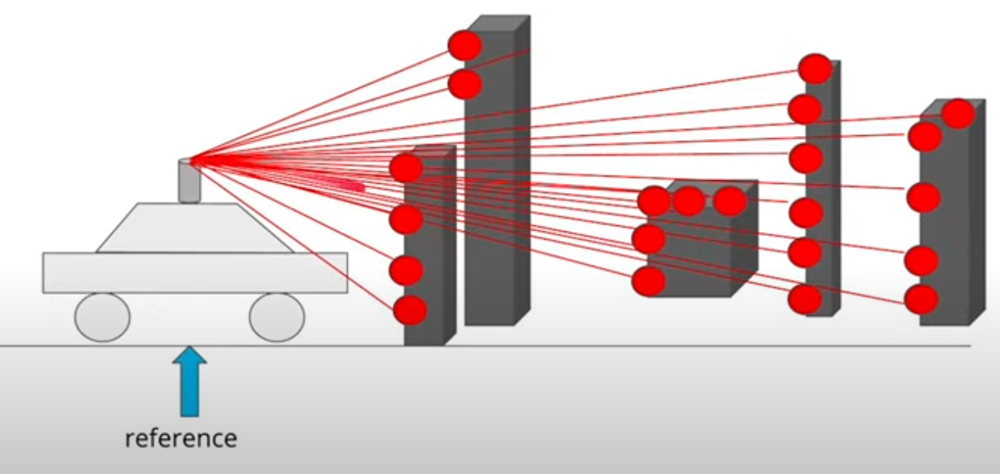
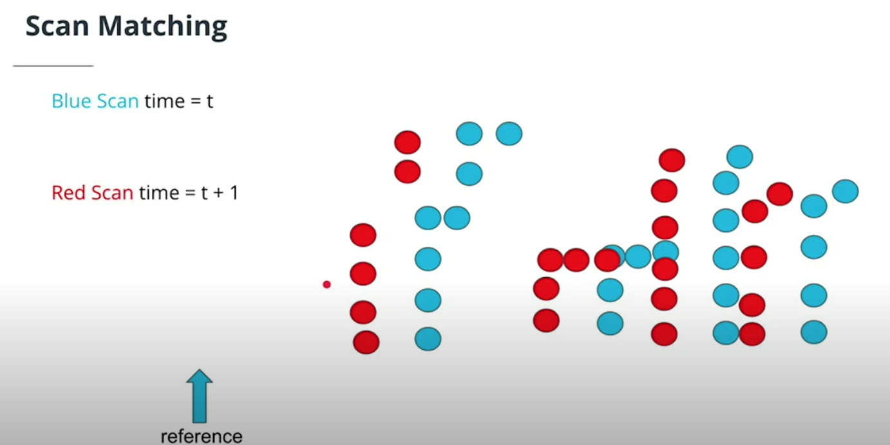
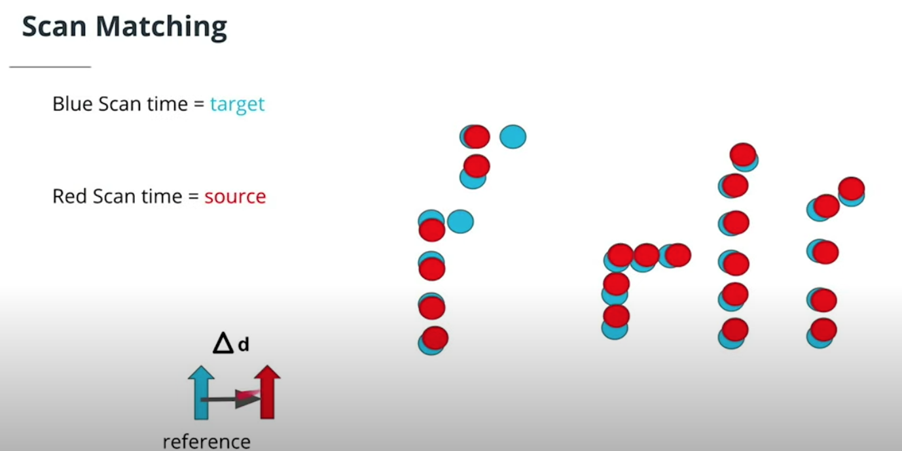
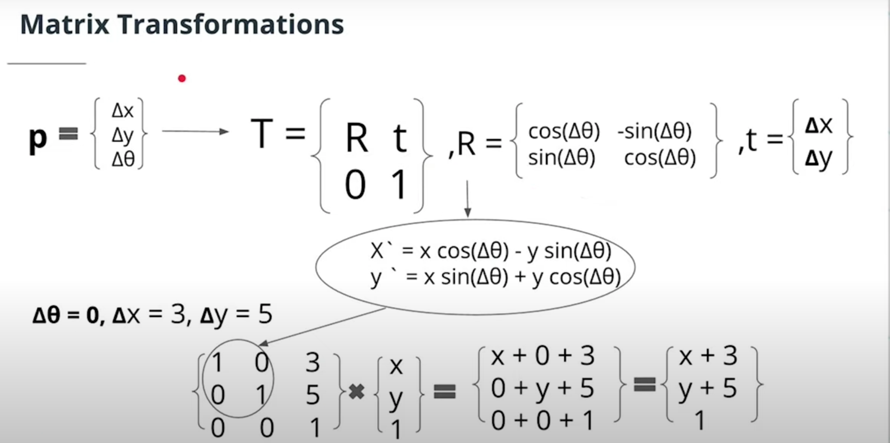
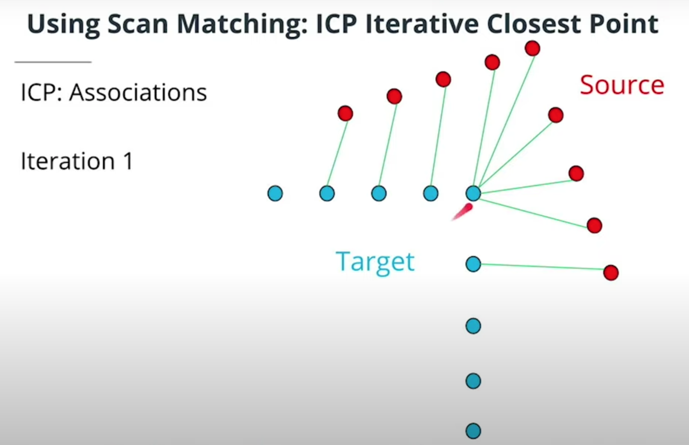
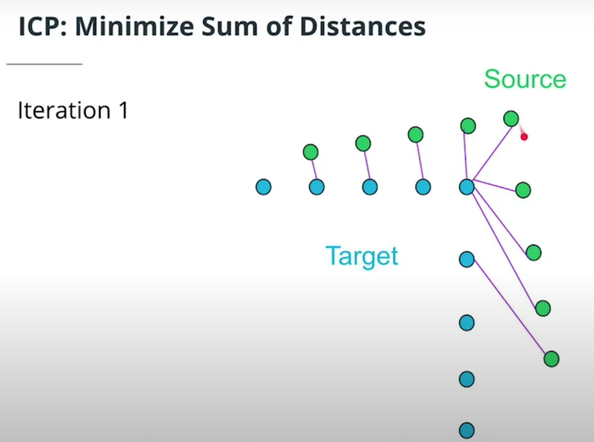
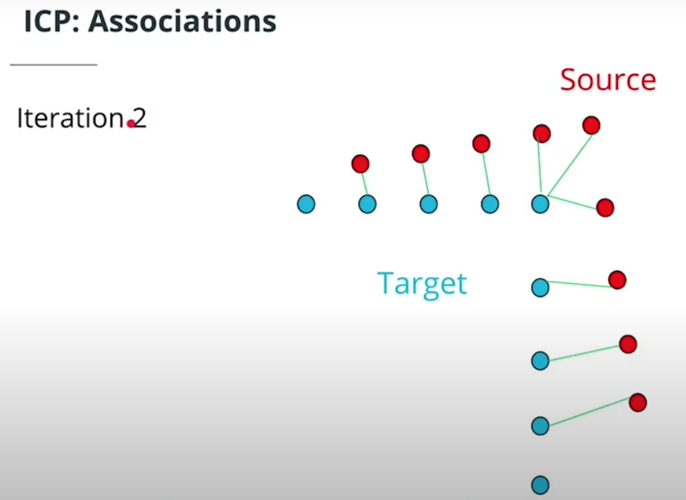
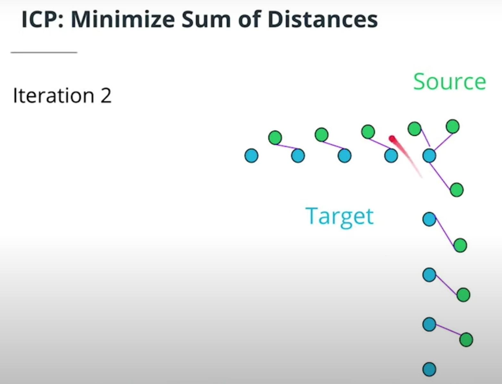
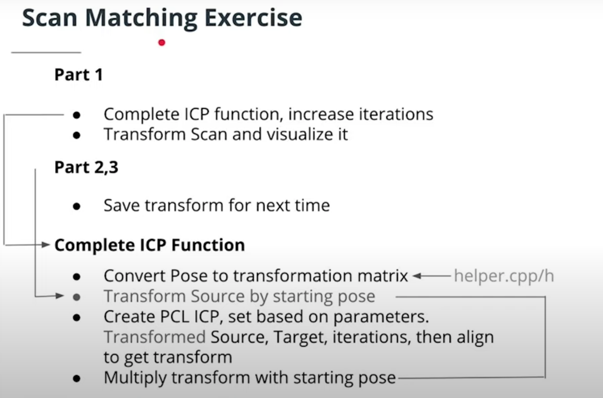

# Scan Matching

Challenge: `Where is the robot with respect to the previous frame`

Give `a scan and a map`, or `a scan and a scan`, or `a map and a map`, and find the `rigid-body transformation (translation + rotation)` that aligns them best.


假設當前 frame 的 Lidar data 為 A，和它批配的另一個 frame data 為 B，
如果以 `A 為 起始點 (target/reference)`，`B 為下一個位置點 (source/measured)`，
我們的目的就是找出 `B -> A 的 rigid-body transformation 矩陣 (平移+旋轉)`，
如下範例:

在一台車上配有 LiDAR，它首先先掃描環境，然後汽車稍微移動並再次掃描環境

<p float="left">
  
  
</p>

如果我們將這兩個掃描並排顯示，會發現他們非常相似:

- 藍色掃描是汽車在時間 t 進行的第一次掃描
- 藍色掃描是汽車在時間 t+1 進行的第二次掃描

<p float="left">
  
  
</p>


所以:

- Scan matching compares two very similar lidar scans to get a transformation in the movement
- You then stitch together the transforms to localize
- The transforms can be represented mathematically by a transformation matrix, as below:

    

## Iterative Closest Point (ICP)

由於採集設備不同、拍攝視角不同等等因素的影響，即使是同一個物體所得到的點雲也會有較大的差異，主要是旋轉或者平移的變化。對於一組圖像數據集中的兩幅圖像，需要通過尋找一種空間變換把一幅圖像映射到另一幅圖像，使得兩圖中對應於空間同一位置的點一一對應起來，從而達到信息融合的目的

```
找到一個 transformer matrix
使得 scan frames 之間最鄰近點的距離最小化
```

Step 1

<p float="left">
  
  
</p>


Step 2

<p float="left">
  
  
</p>

ICP has a `target(reference)` scan and a `source` scan.

- Associations are made between the source points and target points
- A transform that minimizes the sum of association's distances is performed

Steps 1 and 2 repeat until associations don't change, and ICP has converged or a certain number of iterations have been done.

### 優缺點

- 優點: 匹配效果最好的演算法，因為充分利用了每一個點
- 缺點: 速度慢，因為使用了所有的點雲

### Example of using ICP in PCL

Sample code: [ICP Example](https://github.com/kaka-lin/autonomous-driving-notes/tree/master/Localization/Scan%20Matching/icp_example)

Reference:
- [How to use iterative closest point](https://pointclouds.org/documentation/tutorials/iterative_closest_point.html)

### Scan Match Exercise



Detail please see [here](https://github.com/kaka-lin/nd013-c3-localization-exercises/tree/master/Scan%20Matching/ICP)
