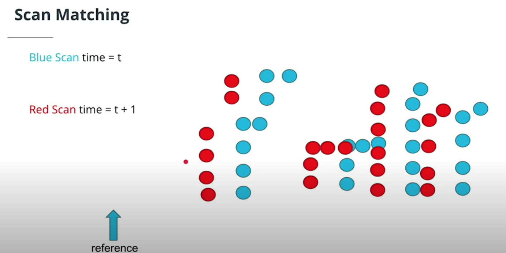
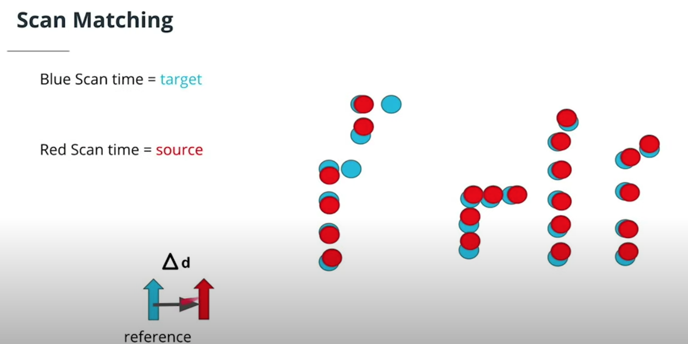

# Scan Matching

- Scan matching compares two very similar lidar scans to get a transformation in the movement
- You then stitch together the transforms to localize
- The transforms can be represented mathematically by a transformation matrix:

    

## Iterative Closest Point (ICP)

由於採集設備不同、拍攝視角不同等等因素的影響，即使是同一個物體所得到的點雲也會有較大的差異，主要是旋轉或者平移的變化。對於一組圖像數據集中的兩幅圖像，需要通過尋找一種空間變換把一幅圖像映射到另一幅圖像，使得兩圖中對應於空間同一位置的點一一對應起來，從而達到信息融合的目的

Step 1

Step 2

ICP has a target scan and a source scan.

- Associations are made between the source points and target points
- A transform that minimizes the sum of association's distances is performed

Steps 1 and 2 repeat until associations don't change, and ICP has converged or a certain number of iterations have been done.

### Example of using ICP in PCL

- [How to use iterative closest point](https://pointclouds.org/documentation/tutorials/iterative_closest_point.html)

### Scan Match Exercise

Detail please see [here](https://github.com/kaka-lin/nd013-c3-localization-exercises/tree/master/Scan%20Matching/ICP)
