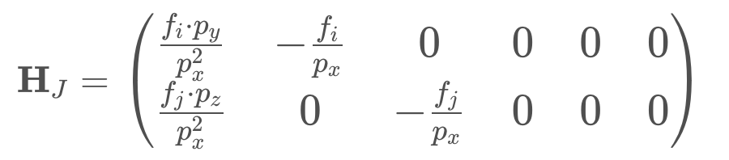

# Extended Kalman Filter (EKF)

## Nonlinear Measurement Functions


If we map this gaussian to a non-linear function `h` then the result is not a gaussian distribution anymore, so the kalman filter is not applicable anymore.

Example:

我們使用從 `mean=0, std=3` 的高斯分佈中隨機抽取的 10000 個變數，然後計算 non-linear function `h(x) = atan(x)` 的值，可以看到結果不再是高斯分布，因為 kalman filter update function 將不再適用，如下圖所示:


### Linear Approximation

解法就是將非線性方程式用`線性逼近`，這就是 Extended Kalman Filter 的 key idea。

將上述範例使用線性逼近方程式取代非線性方程式後，結果如下:


Extended Kalman Filter 使用 `first taylor expansion` 來逼近非線性方程式。

## How to Perform a Taylor Expansion

The general form of a Taylor series expansion of an equation, *h(x)*, at point *μ* is as follows:


where *n!* denotes the factorial of n. You don't have to fully understand the Taylor series, but if you want more details, you can find them [here](https://en.wikipedia.org/wiki/Taylor_series). If μ is close to x, (x−μ)^2 and higher order terms become very small, so we can neglect them.


Simply replace h(x) with a given equation, find the derivative, and plug in the value μ to find the Taylor expansion at that point μ.

In our example, `μ = 0`, and `h(x) = atan(x)`

and its derivative is:


```
h(x) ≈ h(u) + h'(u)(x - u)
h(x) ≈ atan(0) + (1 / (1 + 0^2) * (x - 0))
h(x) ≈ 0 + x / (1 + 0)
h(x) ≈ x
```

使用泰勒展開逼近 h(x) 後，結果如下:


## Multivariate Taylor Series

Now that you’ve seen how to do a Taylor series expansion with a one-dimensional equation, we’ll need to look at the Taylor series expansion for multi-dimensional equations. Recall from the [Camera Measurement Model]() part that the h function is composed of two equations that show how the predicted state `x` is mapped into the image space:


These are multi-dimensional equations, so we will need to use a multi-dimensional Taylor series expansion to make a linear approximation of the h function. Here is a general formula for the multi-dimensional Taylor series expansion:


Here we have simply replaced the first derivative h'(μ) with the `Jacobian matrix H_J(μ)`. The Jacobian matrix contains the partial derivatives of the multi-dimensional function h.

### Exercise: Jacobian

`Derivation of H_J`

Here is the complete derivation of the Jacobian H_J for camera measurements. Don't worry if you can't follow every step in detail, it is more important to understand the overall idea of linearization and to be able to implement the resulting Jacobian. Remember that `projecting our 6D state vector to 2D image space gives the following nonlinear camera measurement function`:


We are therefore looking for a 2x6 Jacobian H_J:


We can calculate all entries of H_J as follows:


Further, all derivatives after `velocity components are zero`, because `velocity is not used in the measurement function`. Summing it up, our Jacobian H_J is:



please see [here](https://github.com/kaka-lin/nd013-c2-fusion-exercises/blob/main/lesson-3-EKF/exercises/starter/3_measurements.py)

## EKF Algorithm


