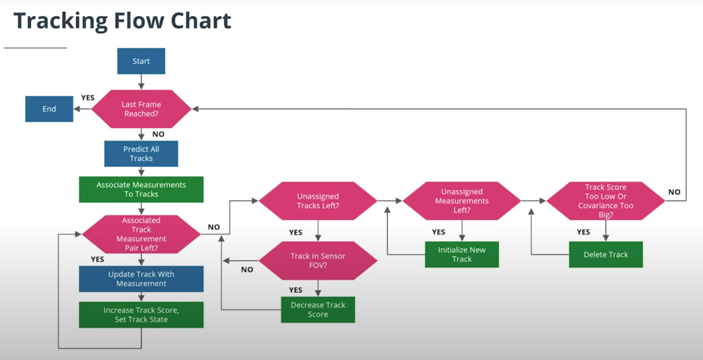
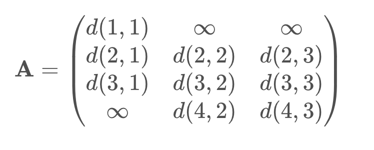

# Multi-Target Tracking

Example:

人類眼中如下


LiDAR眼中如下


Tracking Flow:



A multi-target tracking system has to fulfill the following tasks in addition to a single-target tracking:

- `Data Association`:
  - Associate measurements to tracks
- `Track Management`:
  - Initialize new tracks
  - Delete old tracks
  - Assign some confidence value to a track

## Tracking Initialization

### State Initialization

The `Track Management` contains a track list where all currently valid tracks are stored. At first, the track list is empty. When the first measurement arrives, we store all we need data as a state `x` (px, py, pz, vx, vy, vz), as below:


* Notes:
  * LiDAR 無法偵測速度，所以我們將速度設為0，並且有很高的 velocity uncertainty

  * An unassigned lidar measurement `z = (z_1, z_2, z_3)^T` first has to be converted from sensor to vehicle coordinates:

    

    Then we can initialize the state of a new track as follows:

    `X0 = (px, py, pz, 0, 0, 0)`

### Covariance Initialization

Get a measurement covariance matrix R from the lidar sensor.

R can visualized as an ellipse where the length of axis is determined by standard deviations in x and y


- The 3x3 Matrix for the velocity estimation error covariance `P_vel` can be initialized with a diagonal matrix containing large diagonal values, `since we cannot measure velocity and therefore have a huge initial velocity uncertainty.`

    example: [1_initialization.py ](https://github.com/kaka-lin/nd013-c2-fusion-exercises/blob/main/lesson-4-MTT/exercises/starter/1_initialization.py)

    ```python
    sigma_p44 = 50
    sigma_p55 = 50
    sigma_p66 = 5
    ```

## Track score

如下圖所示，Track1 是真的有車輛，Track2 則是錯誤偵測


那如何區分是 True positive or False positive 呢？

`Track score` or `existence probability` can help, as below:


We can define a simple `track score` by setting:

`
score = #detections in last n frames / n
`

如上圖所示，假設 `n = 5`:

```
1. Track1 = 1, score = 1 / 5 = 0.2
   Track2 = 1, score = 1 / 5 = 0.2

2. Track1 = 2, score = 2 / 5 = 0.4
   Track2 = 1, score = 1 / 5 = 0.2

3. Track1 = 3, score = 3 / 5 = 0.6
   Track2 = 1, score = 1 / 5 = 0.2

4. Track1 = 4, score = 4 / 5 = 0.8
   Track2 = 1, score = 1 / 5 = 0.2

5. Track1 = 5, score = 5 / 5 = 1
   Track2 = 1, score = 1 / 5 = 0.2
```

就這樣 Track1 的分數達到最大值: 1，
而 Track2 直到最後都是 0.2，且在下一個 n 時才又更新降為 0

There are many other possibilities to define a track score, confidence or existence probability, you can even define your own!

## Track state

Based on the track score, a track state can be defined, for example `initialized`, `tentative` or `confirmed`.


## Track Deletion

Example Track Deletion Criteria

- Confirmed tracks:
  - Delete if score < 0.6. This only holds for confirmed tracks, so the score must have been above 0.8 before and then drop below 0.6.
  - Delete if  P_11 < 3^2 or P_22 < 3^2. This means our object could be anywhere inside a circle of 3 meters radius, the position uncertainty has increased so much that the track should be deleted.

- Tentative or initialized tracks:
  - Delete if score < 0.17. Note that this threshold is much lower than for confirmed tracks, we don't want new tracks to be immediately deleted before they can stabilize.
  - Delete if  P_11 < 3^2 or P_22 < 3^2.

Again, these are heuristic design parameters, feel free to experiment and define your own in your project!

## Visibility

如下圖所示，因為目標物只在雷達中被看見，所以當再計算 Track score 時，在 LiDAR 時會上升但在 Camera 時會下降，導致最後分數約在0.5左右，但這是錯的，因為我們知道 Camera 看不到目標物，所以應該只計算 LiDAR Measurement 且分數應該趨近 1.0。如下圖所示:


為了避免這種狀況，我們需要 `visibility reasoning`。
The track management module needs to cosider whether an object is in the visible area of a sensor or not. More advanced sensor fusion system will use detection probabilities for each sensor that consists of a probabilities that the object is visible for this sensor.

- We need a detection probability or visibility reasoning to avoid oscillating track scores.

### Implement

Overview of variables for visibility reasoning


Take a look at the image. We want to check the visibility of the red object, whose coordinates p_x, p_y are already transformed to sensor coordinates in this image. We have to `calculate the angle α of the red target with respect to the vehicle. If the absolute value of α is smaller than the camera's opening angle ϕ, we can see the object, otherwise we can't.` So how can we calculate α?

計算紅色目標相對於車輛的角度α。如果 α 的絕對值小於相機的張角 φ，我們可以看到物體，否則我們不能。

Note that we have a right-angled triangle here, so we can calculate α with trigonometric functions. We have given the opposite side p_y and the adjacent side p_x of the triangle, where we assume p_x > 0 therefore we can use the tangent function:

```
tan(α) = p_y / p_x
```

This leads to the required angle α using the inverse tangent function, or arcus tangents:

```
α = arctan(p_y / p_x)
```

For detail, please see [fov.py](https://github.com/kaka-lin/nd013-c2-fusion-exercises/blob/main/lesson-4-MTT/exercises/starter/2_fov.py)

## Data Association

How can we decide which track to update with which measurement? This is the task of the `data association module`.

The data association module: calculates track measurement pairs that tell us which measurement probably originated from which track.

For exmaple:


- 圓圈: track
- 叉叉: measurement

他們兩個必須關聯起來形成 `track measurement pairs`

For the association, we make some assumptions:

- Each track generates at most one measurement
- Each measurement originates from at most one track

一個最簡單的方法就是用最近的 measurement 更新每個 track，如上圖所示。

### Euclidean Distance


根據歐幾里得距離來算的話，measurement 更接近右邊的 track，所以將他與右邊的 track 連起來。

但如果考慮 track 的 position  uncertainty (covariance P) 的話，假設左邊 track 的 covariance_P 比較高右邊比較小，基本上 track 的真實位置有可能是出現在 left track，且 measurement 位於又橢圓之外，因此 measurement 不太可能來自右 track，如圖所示:


因此我們應該是將 measurement 與 left track 關聯起來而不是 right track。

因為我們需要一個考慮 uncertainty 的 distance metric。
如下考慮 `Mahalanobis Distance (馬哈拉諾比斯距離)`

### Mahalanobis Distance (MHD, 馬哈拉諾比斯距離)


MHD like euclidean distance, the MHD `compares the state position with the measurement`, or in other words the MHD `use the residual gamma (γ=z−Hx)`, tha main difference is also `includes the inverse of the residual covariance S`

- S: is the estimation error covariance P transformed to measurement space plus the measurement covariance.

    So you can imagine S as similar to the blue ellipses

### Summary

- The `data association` assigns measurements to tracks and decides which track to update with which measurement.
- As a distance measure for this decision, the `Mahalanobis distance` is used (note that it actually contains a squared distance):

    

### Data Association Algorithm


- `Simple Nearest Neighbor (SNN)`:

    data association calculates all Mahalanobis distances between tracks and measurements, then iteratively updates the closest association pair.

The SNN is not globally optimal, this can be resolved using the:

- `Global Nearest Neighbor (GNN)`:

    data association, which we will not cover here. You can check out [this paper](http://ecet.ecs.uni-ruse.bg/cst/docs/proceedings/S3/III-7.pdf) if you want to read more about it.

Both data association methods enforce hard decisions in ambiguous situations. More advanced:

- `Probabilistic Data Association (PDA)`:

  techniques can avoid these hard decisions and resulting errors. Again, we will not cover them here, but you can search the web for the different variants (e.g. PDA, JPDA, JIPDA) if you are interested, for resources such as [this paper](https://www.researchgate.net/publication/224083228_The_probabilistic_data_association_filter).

### Association Matrix

we have N tracks and M measurements.
The `association matrix A` is an `N × M matrix` that contains the Mahalanobis distances between each track and each measurement:


- We also need a list for unassigned tracks and a list for unassigned measurements.
- We look for the smallest entry in A in order to determine which track to update with which measurement, then we delete this row and column from A and the track ID and measurement ID from the lists. We repeat this until A is empty.

For example, as below:


### Gating

Gating `reduces the association complexity by removing unlikely association pairs`.

```
計算所有可能的距離的工作量太大，
且計算太遙遠或是非常不可能的組合非常沒意義
```

For example:


在前三個 track 更新後，我們還剩下:

- false positive measurement
- two unassigned tracks


Now, SSN would assign the measurement to the green track and update it. This does not make sense beacuse both are not close at all. How can we avoid that?


Because the residual is Gaussian, the `Mahalanobis distance follows a χ^2 distribution`.

A measurement lies inside a track's gate if the Mahalanobis distance is smaller than the threshold calculated from the inverse cumulative χ^2 distribution as follows:


```
0.995: 95% true measurement 會在 gate 內，
       只有 5% 的風險會將 true measurement 丟在 gate 外
```

If a measurement lies outside a track's gate, we can set the distance to infinity, for example:




圖中的虛線為非常不可能的組合，我們將它設為無限大

#### Implementing

For detail please see [gating.py](https://github.com/kaka-lin/nd013-c2-fusion-exercises/blob/main/lesson-4-MTT/exercises/starter/4_gating.py)

Hints:

- To calculate the inverse cumulative `χ^2 (chi^2)` distribution `F_{χ^2}^{-1}(p∣df)` with probability *p* and degrees of freedom *df* (which equals the dimension of the measurement space here), you can use the scipy package:

    ```python
    from scipy.stats.distributions import chi2

    chi2.ppf(p, df)
    ```

    `ppf` stands for percent point function, which is the inverse of the cumulative density function. See the [related scipy documentation](https://docs.scipy.org/doc/scipy/reference/generated/scipy.stats.chi2.html) for more details.

- To get the indices of the minimum entry in the association matrix A, you can use `numpy.argmin`. Usually, this function returns the index of the flattened array. In order to avoid this, we can use numpy.unravel_index as follows:

    ```python
    np.unravel_index(np.argmin(A, axis=None), A.shape)
    ```

    Check out the [numpy argmin documentation](https://numpy.org/doc/stable/reference/generated/numpy.argmin.html) for more details!

## Evaluation

To evaluate the performance of our tracking, we can use the Root Mean Square Error (RMSE), which calculates the residual between estimated state and ground truth state:


