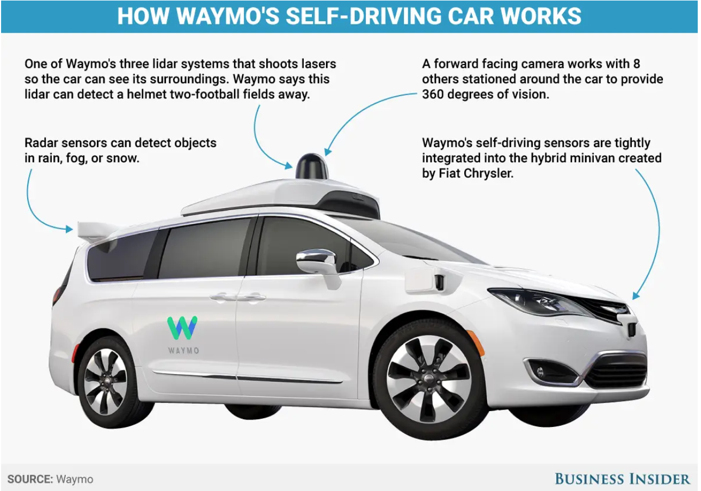
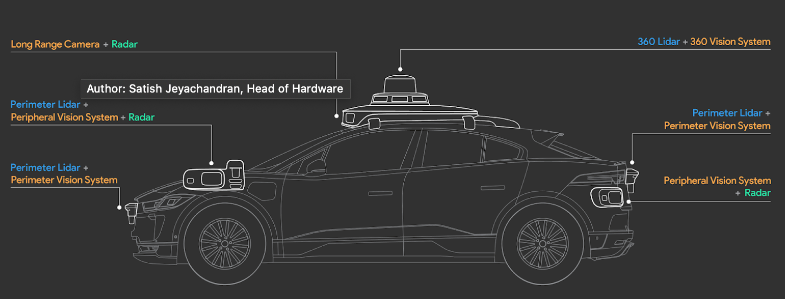

# Sensor Fusion and Tracking

We do not only want to detect objects in a single time frame, we also want to know `where the objects are moving` and `where they will be in the next time frame`.To this end, we will learn how to track objects over time and estimate their position and velocity. We will also include lidar data to improve the tracking results through sensor fusion

## Why Sensor Fusion

每個 Sensor 都有其優點和缺點，單靠相機是無法處理所有情況，例如:

- 如果相機被太陽遮住了怎麼辦？
- 如果視野被雨滴干擾怎麼辦？
- 如何才能測量其他車輛的準確距離呢？

以上各種情況都需要搭配不同 Sensor 來做偵測與改善，如:

- `雷達 (Radar)`
- `光學雷達 (LiDAR)`

它們具有不同的物理測量原理，可以提高環境感知系統的可靠性。如下圖:

[Waymo Sensor Suite ](https://blog.waymo.com/2020/03/introducing-5th-generation-waymo-driver.html)

## Chapter

- [Kalman Filters](https://github.com/kaka-lin/autonomous-driving-notes/tree/master/Sensor%20Fusion%20and%20Tracking/Kalman%20Filters)
- [Sensor Fusion](https://github.com/kaka-lin/autonomous-driving-notes/tree/master/Sensor%20Fusion%20and%20Tracking/Sensor%20Fusion)
- [Multi-Target Tracking](https://github.com/kaka-lin/autonomous-driving-notes/tree/master/Sensor%20Fusion%20and%20Tracking/Multi-Target%20Tracking)
