# Sensor Fusion

介紹 Sensor Fusion 流程，如下圖:

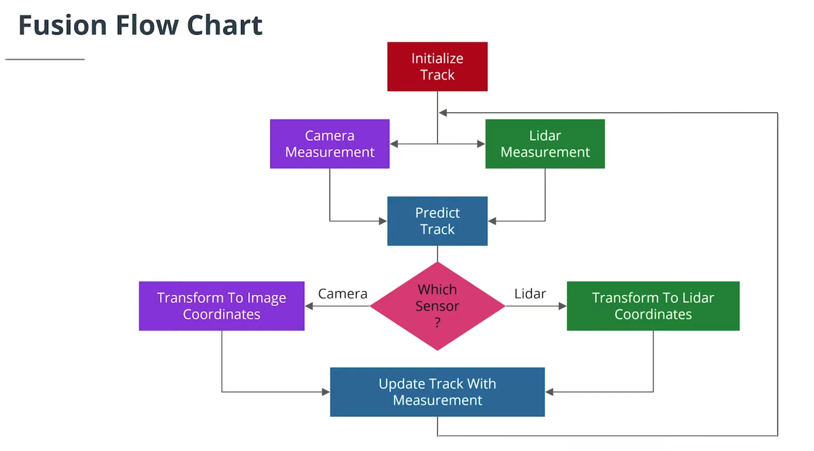

從上圖可以將流程大致分成三個部份，如下:

- [Lidar Measurement Model](#lidar-measurement-model)
- [Camera Measurement Model](#camera-measurement-model)
- [Coordinate Transforms](#coordinate-transforms)

Example:

假設今天有一輛車，我們想要預估和追蹤這台車輛，如下:

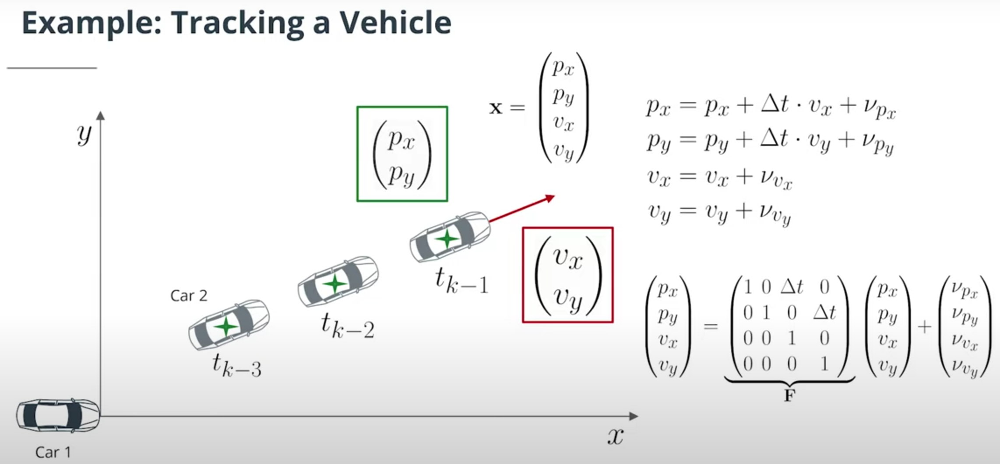

如上圖所示，我們想用 `Cameta` 和 `LiDAR` 估測車輛的狀態。我們將使用 `Extended Kalman Filter` 來達成。

- `Extended Kalman Filter`:

    It is extended in the sense that it can handle more complex motion and measurement models than a standard Kalman filter.

## Kalman Filter

現在讓我們來複習 `Kalman Filter`，Please see [here](https://github.com/kaka-lin/autonomous-driving-notes/blob/master/Sensor%20Fusion%20and%20Tracking/Kalman%20Filters/kalman_filters.md)

After we have a basic knowledge of `Kalman filter`, we can fit each equation to fusion flow chart as below:

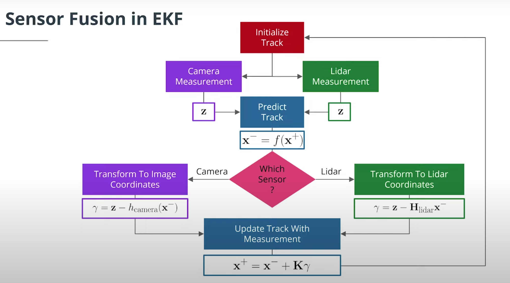

#### Prediction Details

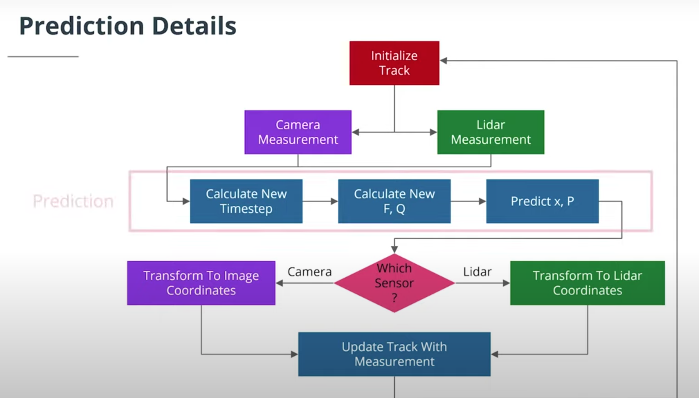

#### Process Nosie Covariance Q

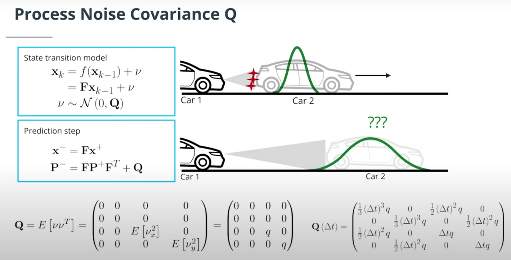

## Lidar Measurement Model

現在讓我們來看看光達的部分，如下:

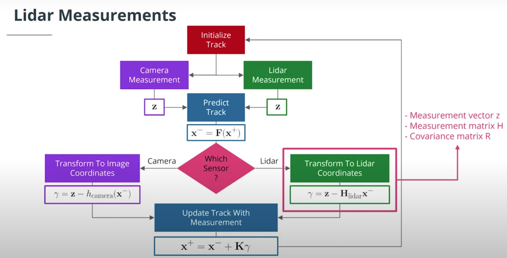

如下圖所示:

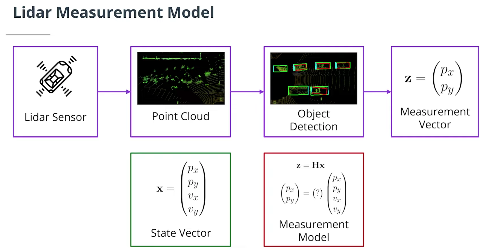

1. Lidar Sensor output is `point cloud`.

2. `3D object detection` with point cloud: the object detection gives us the object's position `(px, py)` as of measurement input for our Kalman filter.

因此，model 在每個信號時間範圍(single timeframe)內檢測其他車輛，然後可以應用 `kalman filter` 來隨著時間推移跟蹤目標。

- `z`: is the `measurement vector`.

    For a lidar sensor, the `z` vector contains the position measurements in x and y.

    ```
    z = (px, py)
    ```

- `H`: is the matrix that projects your belief about the object's current state into the measurement space of the sensor.

    For lidar, this is a fancy way of saying that we discard velocity information from the state variable since the lidar sensor only measures position: The state vector `x` contains information about (px, py, vx, vy).

Whereas the `z` vector will only contain (px, py). Multiplying `Hx` allows us to compare x, our predicted state, with `z`, the sensor measurement.

我們的 `state is a 4D vector (px, py, vx, vy)` -> 找出正確 H 將資料從 `state-space 投影到 2D measurement space`

### LiDAR measurement matrix

從上我們可得:

```
H = [[1, 0, 0, 0],
     [0, 1, 0, 0]]
```

### Measurement Noise Covariance Matrix R Explanation

Noise vector `w`: is it a distribution with zero mean and a `2 x 2` covarance matrix which comes from the product of the vertical vector `w` and its transpose:

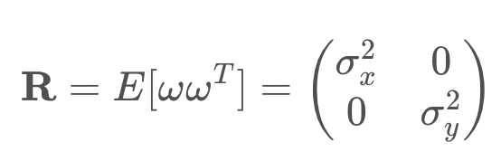

- R: `measurement noise covarance matrix`. Represents the `uncertainty in the position measurements we receive from the lidar sensor`.

    Generally, the parameters for the measurement noise covariance matrix will be provided by the sensor manufacturer or have to be determined in test drives.

## Camera Measurement Model

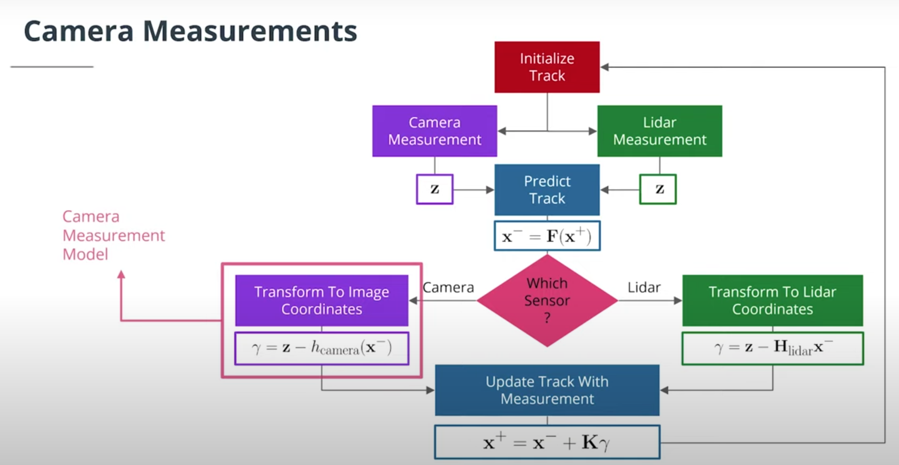

Projection to Image

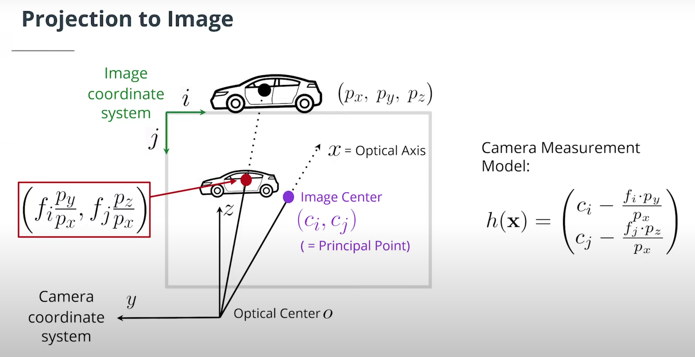

- (ci, cj): is the `image center` or `principal point` in image coordinates, derived from intrinsic camera calibration.

- (fi, fj): is the `focal length` in image coordinates, derived from intrinsic camera calibration.
Projecting a 3D point (or a 6D state vector, since we simply ignore the velocity components) to 2D image space gives the following `nonlinear measurement function`

    

#### H versus h(x)

The H matrix from the lidar lesson and h(x) function from the camera lesson are actually accomplishing the same thing: they are both needed to calculate the residual γ=z−Hx in the update step.

But for camera, there is no H matrix that will map the state vector x into image coordinates; instead, you need to `calculate the mapping manually to convert from cartesian coordinates to image coordinates`.

Hence for camera, `γ=z−Hx becomes z−h(x)`.
- h: is a nonlinear function.

### Extended Kalman Filter

Please see [here](https://github.com/kaka-lin/autonomous-driving-notes/blob/master/Sensor%20Fusion%20and%20Tracking/Kalman%20Filters/extended_kalman_filters.md)

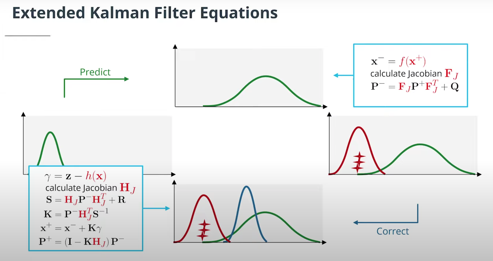

## Coordinate Transforms

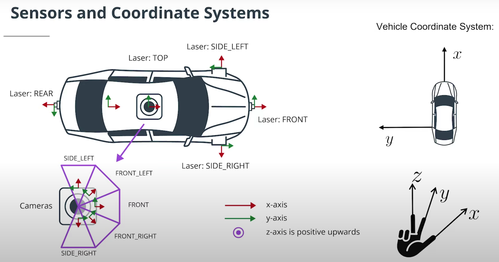


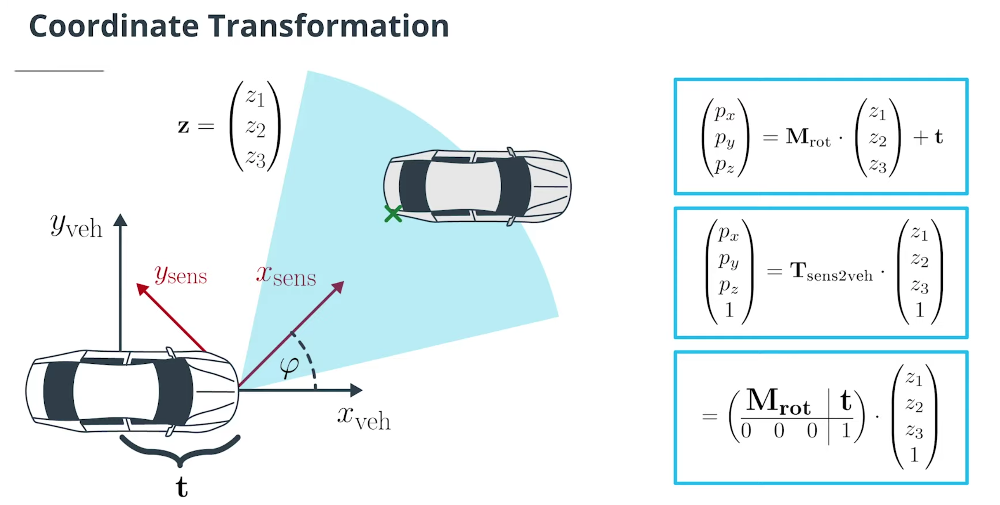

- M_rot: Rotation Matrix
- t: Translation vector
- T_sen2veh: Transformation Matrix

    converts from sensor coordinates to vehicle coordinates using `homogeneous coordinates.

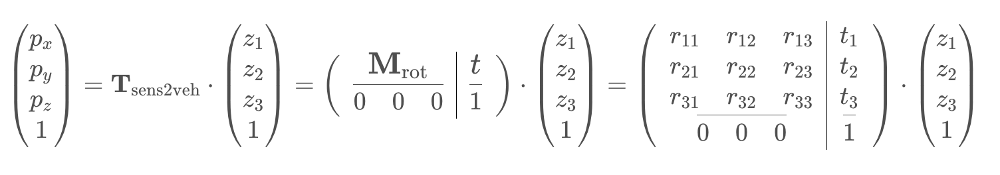

Example:

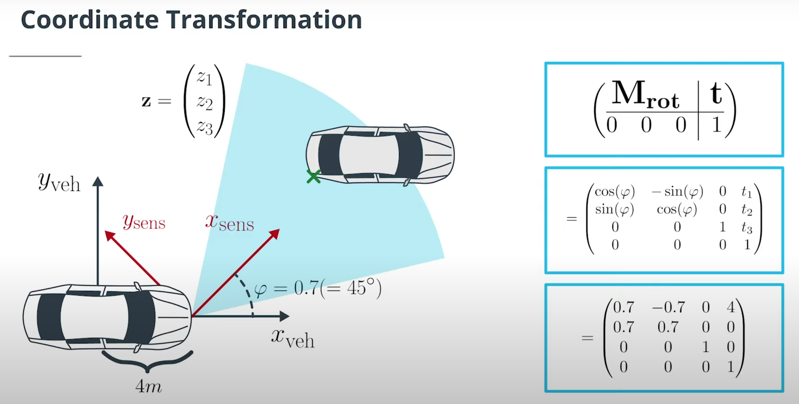
