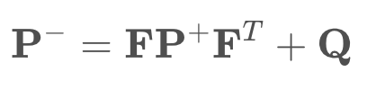

# Derivation of Covariance Rotation

The derivation of the rotation formula for the covariance. The measurement covariance `R` is defined via the expectation value *E* (see also the Wiki page on [Covariance Matrices](https://en.wikipedia.org/wiki/Covariance_matrix)):

Remember the measurement equation:

where `ω∼N(0,R)` is the zero-mean measurement noise with covariance `R`. Since ω is zero-mean, the expectation value of `z` is simply `h(x)`:

This gives us:

Now we want to rotate the measurement from sensor to vehicle coordinates, so we get (note that `(AB)^T = B^T * A^T`)

A similar reasoning leads to many of the Kalman filter equations from the previous lessons. For example, if you want to go above and beyond, you could try to derive the reason for the covariance prediction:

or for the residual covariance:

